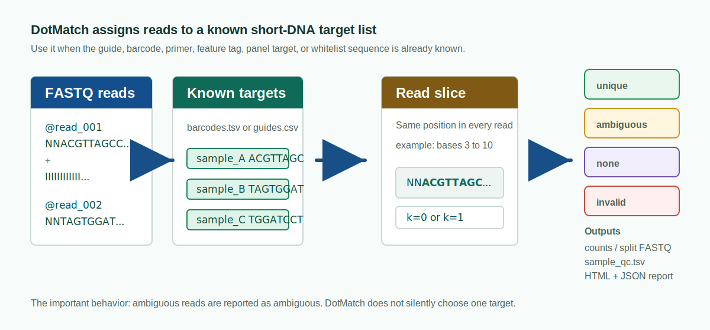

# DotMatch

[](https://github.com/dnncha/dotmatch/actions/workflows/ci.yml)
[](LICENSE)
[](CITATION.cff)

DotMatch is a command-line tool for a common sequencing job: you already know
the short DNA sequences you expect, and you need to count or split reads by
those sequences without hiding ambiguous cases.

It is built for CRISPR guide counting, inline barcode demultiplexing,
fixed-window feature/barcode assignment, primer or adapter-prefix checks,
amplicon-panel starts, whitelist-style assays, and barcode panel design for
known-target assignment. It is not a genome aligner, a basecaller, a UMI entropy
generator, or a replacement for downstream screen statistics.



## Install

DotMatch is available from Bioconda for `linux-64` and `osx-64`:

```bash
mamba create -n dotmatch -c conda-forge -c bioconda dotmatch=0.1.2
conda activate dotmatch

dotmatch --version
dotmatch dist ACGT AGGT
dotmatch leq 1 ACGT AGGT
```

In an existing Conda environment with Bioconda and conda-forge configured:

```bash
conda install -c conda-forge -c bioconda dotmatch
```

Apple Silicon Conda environments are not published by Bioconda for this first
release; build from source on `osx-arm64`.

## The Basic Idea

A fixed window means DotMatch looks at the same position in every read. For
example, bases 24-43 might contain a CRISPR guide, or bases 1-8 might contain an
inline barcode. DotMatch extracts that slice, compares it with your target
table, and records the assignment result.

For each read, DotMatch reports one outcome:

| Outcome | Meaning | Why it matters |
| --- | --- | --- |
| `unique` | exactly one target is compatible | counted or written to the matching FASTQ |
| `ambiguous` | more than one target is compatible | kept out of forced assignments |
| `none` | no target is close enough | available for unmatched-read review |
| `invalid` | the requested read window cannot be extracted | visible in QC instead of disappearing |

This is the main design choice. If a read could belong to more than one guide or
barcode, DotMatch reports the ambiguity instead of silently choosing a target.

Typical outputs include count matrices or demultiplexed FASTQs, `sample_qc.tsv`,
top-unmatched tables, target-library audit files, `summary.json`, and
self-contained HTML reports.

## Barcode Troubleshooting

For barcode runs, DotMatch can inspect the common reasons reads fail assignment:
wrong barcode position, wrong barcode length, duplicate barcodes, unsafe
one-mismatch correction, ambiguous rescue, low-quality correction candidates,
invalid read windows, and high-count unmatched sequences.

```bash
dotmatch barcode autopsy \
  --barcodes barcodes.tsv \
  --reads pooled.fastq.gz \
  --scan-starts 0:12 \
  --k-values 0,1 \
  --out-dir autopsy
```

Open `autopsy/report.html` first. The TSV and JSON files beside it are there for
pipelines and lab handoff: `findings.tsv`, `offset_scan.tsv`,
`correction_safety.tsv`, `top_unmatched.tsv`, and `provenance.json` with the
commands and settings used for the run.

Speed is useful only after the assignment rules are clear. The checked barcode
example documents the exact comparator settings in
[docs/benchmarks/barcode_demux](docs/benchmarks/barcode_demux/README.md).

## Barcode Panel Design

DotMatch can design and certify barcode panels for the same assignment rules
used later by demux and counting. The point is not just to emit sequences. A
designed panel is shipped with a machine-checkable safety certificate, per-target
safety rows, collision tables, ambiguous-variant examples, plate layout, lab
exports, and a report.

```bash
dotmatch panel design \
  --n 96 \
  --length 16 \
  --preset illumina-inline-strict \
  --min-hamming-distance 5 \
  --min-levenshtein-distance 4 \
  --gc-min 0.35 \
  --gc-max 0.65 \
  --max-homopolymer 3 \
  --avoid-rc \
  --seed 42 \
  --out-dir dotmatch_96x16/
```

Important commands:

```bash
dotmatch panel check barcodes.tsv --k 1 --metric hamming --out-dir panel_check/
dotmatch panel optimize vendor_barcodes.tsv --n 24 --out-dir optimized_panel/
dotmatch panel simulate barcodes.tsv --reads 1000000 --out-dir simulation/
dotmatch panel layout barcodes.tsv --plate 96 --out plate_layout.tsv
dotmatch panel export barcodes.tsv --format illumina-samplesheet --out-dir sample_sheet_templates/
```

The certificate preserves DotMatch outcomes: `unique`, `ambiguous`, `none`, and
`invalid`. It fails a configured edit distance if any possible barcode variant
inside that distance can map ambiguously or silently to the wrong barcode. The
current certificate checks all variants up to `k=2`; larger edit distances are
refused rather than partially certified.

Outputs include `barcodes.tsv`, `design_report.json`, `design_trace.tsv`,
`panel_check/panel_summary.json`, `target_safety.tsv`, `collision_pairs.tsv`,
`ambiguous_error_spheres.tsv`, `flanked_sequences.tsv`, `plate_layout.tsv`,
`sample_sheet_templates/SampleSheet.csv`, `report.html`, and
`README_FOR_LAB.md`.

See [Barcode Panel Design](docs/barcode-panel-design.md) and the checked example
in
[docs/benchmarks/barcode_panel_design](docs/benchmarks/barcode_panel_design/README.md).

## When To Use DotMatch

DotMatch is a good fit when you have a table of expected short sequences and the
biological question is "which known guide, barcode, primer, feature tag, or
panel target did this read contain?"

Common uses include:

- CRISPR pooled-screen guide counting with MAGeCK-compatible output;
- fixed-position barcode demultiplexing from FASTQ/FASTQ.gz;
- per-read assignment of 10x guide-capture or feature-barcode windows;
- primer-start, amplicon-panel, adapter-prefix, or whitelist-style assays;
- designing, optimizing, certifying, simulating, and exporting barcode panels;
- target-library audits before allowing one-edit correction;
- validating a fast assignment run against a full target-by-target scan or Edlib.

DotMatch is not a genome aligner or basecaller. It does not produce SAM/BAM,
CIGAR strings, variant calls, cell/UMI quantification, UMI entropy designs,
expression matrices, or screen-level hit-calling statistics. It works on
extracted short windows and known target lists.

## Source And Package Status

Source builds and local Python package installs work on Linux and macOS. You
need a C compiler, `make`, Python 3.9 or newer for the Python package, and zlib
for FASTQ.gz support.

```bash
git clone https://github.com/dnncha/dotmatch.git
cd dotmatch
make

./dotmatch --version
./dotmatch dist ACGT AGGT
./dotmatch leq 1 ACGT AGGT
```

Python install from a checkout:

```bash
python3 -m pip install .
python3 -c "import dotmatch; print(dotmatch.distance('ACGT', 'AGGT'))"
```

Docker build from the repository:

```bash
docker build -t dotmatch:dev .
docker run --rm -v "$PWD:/work" dotmatch:dev dist ACGT AGGT
```

Package status for PyPI, Bioconda, containers, and release archives is tracked
in [Packaging Notes](docs/packaging.md), the
[Release Process](docs/release-process.md), and the machine-readable
[Distribution Status](docs/distribution-release.json). Bioconda is public for
0.1.2; PyPI is not public yet.

The release workflow builds and checks the files that will go to PyPI: a source
distribution, a macOS wheel, and Linux wheels that follow PyPI's manylinux and
musllinux rules. PyPI trusted publishing is configured for those files. We will
only describe PyPI availability after the tagged release is visible on PyPI.

Optional local Workbench: DotMatch also includes a desktop Workbench under
`apps/workbench` for local AssaySpec design, inference, planning, running, and
report review. It is separate from the Bioconda recipe and keeps FASTQ, target,
barcode, spec, and output paths inside a user-selected local workspace. See
[Workbench](docs/workbench.md).

## Quick Example

The core operation is many-read versus many-target assignment. Target files and
read files can be simple TSVs with `id<TAB>sequence`.

```bash
cat > targets.tsv <<'EOF'
bc0	ACGT
bc1	AGGT
bc2	ACGA
EOF

cat > reads.tsv <<'EOF'
r0	ACGT
r1	ACGC
r2	TTTT
EOF

./dotmatch assign 1 targets.tsv reads.tsv
```

Expected output:

```text
mode	read_id	read_seq	target_index	target_seq	distance	status	match_count	second_best_distance
assign	r0	ACGT	0	ACGT	0	unique	3	1
assign	r1	ACGC	0	ACGT	1	ambiguous	2	-1
assign	r2	TTTT	-1		-1	none	0	-1
```

`r1` is deliberately ambiguous: it is within one edit of more than one target,
so DotMatch reports the ambiguity instead of choosing a target.

## CRISPR Guide Counting

For pooled CRISPR screens, `crispr-count` wraps the FASTQ counting engine and
writes a MAGeCK-style count matrix.

```bash
cat > samples.tsv <<'EOF'
sample_id	fastq
plasmid	plasmid_R1.fastq.gz
treatment	treatment_R1.fastq.gz
EOF

./dotmatch crispr-count \
  --library guides.csv \
  --samples samples.tsv \
  --guide-start 23 \
  --guide-length 20 \
  --k 1 \
  --metric hamming \
  --out counts.mageck.tsv \
  --summary qc.json \
  --ambiguous discard
```

Use `--metric hamming` for one-mismatch/no-indel guide-counter-style counting.
Use `--metric levenshtein --indel-window 1` when one-base insertions and
deletions around the guide window should be considered. Ambiguous reads are not
added to guide counts unless you explicitly request diagnostic reporting.

A small worked example is available in
[examples/crispr_guides](examples/crispr_guides/README.md), and a step-by-step
fixture walkthrough is in
[docs/tutorials/crispr-count-first-run.md](docs/tutorials/crispr-count-first-run.md).

## General FASTQ Counting

The lower-level `count` command works with arbitrary known targets and one or
more FASTQ/FASTQ.gz inputs.

```bash
./dotmatch count \
  --targets targets.tsv \
  --reads sample_R1.fastq.gz \
  --sample-label sample_1 \
  --target-start 0 \
  --target-length 20 \
  --k 1 \
  --metric levenshtein \
  --indel-window 1 \
  --ambiguity-policy best \
  --out counts.tsv \
  --target-counts-long target_counts.long.tsv \
  --sample-qc sample_qc.tsv \
  --assignments assignments.tsv \
  --summary summary.json
```

The count table separates exact matches, one-substitution corrections,
one-insertion corrections, one-deletion corrections, and other accepted
corrections. `sample_qc.tsv` records assignment rate, rescue rate, ambiguous and
unmatched fractions, target coverage, zero-count targets, Gini index, and the
number of candidate targets checked after indexing.

Output schemas are documented in [Public Schemas](docs/schemas.md).

## Barcode Demultiplexing

For fixed-position inline barcodes, `demux` writes one FASTQ per uniquely
assigned barcode and can optionally retain ambiguous and unmatched reads.

```bash
./dotmatch demux \
  --barcodes barcodes.tsv \
  --reads pooled.fastq.gz \
  --barcode-start 0 \
  --barcode-length 8 \
  --k 1 \
  --metric hamming \
  --max-correction-qual 20 \
  --out-dir demuxed \
  --summary demux.qc.json \
  --assignments demux.assignments.tsv \
  --ambiguous-out ambiguous.fastq \
  --unmatched-out unmatched.fastq
```

Use `--barcode-length auto` when the barcode sheet contains multiple lengths.
Prefix-overlapping exact matches are reported as ambiguous rather than resolved
by length.

DotMatch also includes an early classic per-cycle BCL demultiplexing command for
small RunInfo/SampleSheet/BCL workflows. CBCL and NovaSeq-style inputs are not
part of the current BCL scope.

## Target Library Audit

Before enabling one-edit correction, audit the target set for collisions and
near neighbors.

```bash
./dotmatch audit \
  --targets guides.tsv \
  --k 1 \
  --audit-mode auto \
  --out-dir audit/
```

The audit output includes duplicate targets, nearby target pairs, collision
clusters, per-target safety, and example query variants that would be ambiguous
at `k=1`.

## Python API

The Python package calls the compiled DotMatch library directly.

```python
import dotmatch

dotmatch.distance("ACGT", "AGGT")
# 1

dotmatch.distance_leq("ACGT", "AGGT", 1)
# True

matcher = dotmatch.Matcher(["ACGT", "AGGT", "ACGA"])
results, stats = matcher.assign_with_stats(["ACGT", "ACGC"], k=1)
```

When working from a source checkout, build the shared library first:

```bash
make shared
DOTMATCH_LIB=$PWD/libdotmatch.dylib PYTHONPATH=$PWD/python python3
```

On Linux, use `libdotmatch.so` instead of `libdotmatch.dylib`.

The older `quickdna` Python package, `quickdna` console script, and `qda`
command remain as compatibility aliases. New workflows should use `dotmatch`.

## Matching Rules

DotMatch treats DNA letters literally. `A`, `C`, `G`, `T`, `N`, and IUPAC
ambiguity symbols are ordinary characters; `N` and IUPAC codes are not expanded
as wildcards.

Supported assignment modes include:

- exact matching (`k=0`);
- Hamming matching for fixed-length one-substitution workflows;
- global Levenshtein matching for substitutions, insertions, and deletions;
- fixed-window `k=2` correction by checking every target;
- explicit ambiguity policies for best-target and whole-radius assignment.

The public policy string reported by the C and Python APIs is:

```text
literal-byte; A/C/G/T/N/IUPAC symbols are ordinary byte symbols; no wildcard expansion
```

## Checked Examples And Benchmarks

The repository includes C tests, command-line fixture tests, Python tests,
randomized checks against an independent edit-distance implementation, and
optional Edlib validation for assignment runs.

Useful local checks:

```bash
make test
make cli-test
make python-test
make python-package-test
```

Reports with data sources, commands, comparator settings, and checked outputs:

- [Why DotMatch / usability comparison](docs/usability-comparison.md)
- [Evidence gallery](docs/evidence-gallery/README.md)
- [Benchmark overview](docs/benchmarks/README.md)
- [Edlib assignment report](docs/benchmarks/native/README.md)
- [Public CRISPR guide-counting report](docs/benchmarks/public_crispr/README.md)
- [Barcode demultiplexing report](docs/benchmarks/barcode_demux/README.md)
- [Feature-barcode assignment report](docs/benchmarks/feature_barcode/README.md)
- [CRISPR guide-capture assignment report](docs/benchmarks/perturb_seq/README.md)
- [Amplicon/panel primer-start report](docs/benchmarks/amplicon_panel/README.md)
- [Oligo/adapter prefix-assignment report](docs/benchmarks/oligo_adapter/README.md)

For a compact list of what has and has not been checked, see
[Evidence Notes](docs/scientific-claims.md). For methods text and citation
language, see [Methods and Citation](docs/methods-and-citation.md).

## Development

```bash
make
make test
make cli-test
make coverage
```

Workflow-manager examples are included for Galaxy, Nextflow, nf-core-style
modules, Snakemake, and MultiQC custom content under
[examples/workflows](examples/workflows/).

Contributions are welcome. Please read [CONTRIBUTING.md](CONTRIBUTING.md),
[SUPPORT.md](SUPPORT.md), and [SECURITY.md](SECURITY.md) before opening issues
or pull requests.

## Citation

If DotMatch is useful in your work, cite the software release using
[CITATION.cff](CITATION.cff). Suggested methods text is provided in
[docs/methods-and-citation.md](docs/methods-and-citation.md).

## License

DotMatch is released under the [Apache License 2.0](LICENSE).
