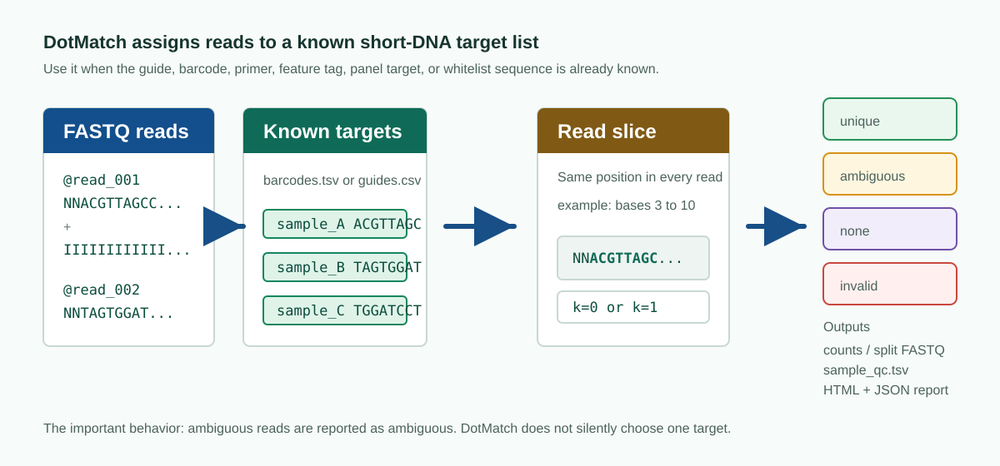
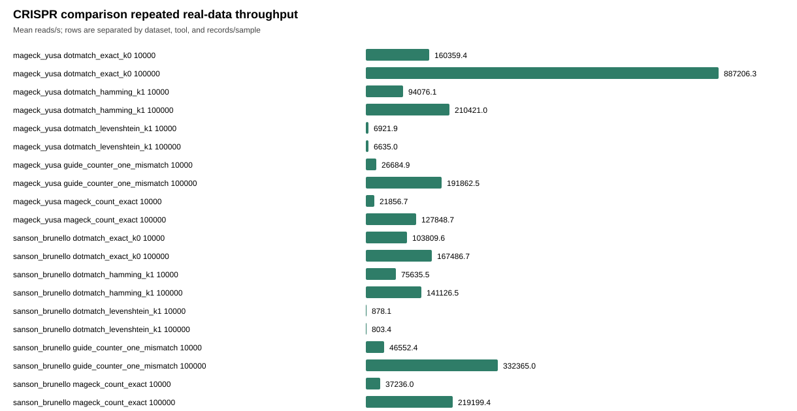

# DotMatch

[](https://github.com/dnncha/dotmatch/actions/workflows/ci.yml)
[](https://pypi.org/project/dotmatch/)
[](https://anaconda.org/bioconda/dotmatch)
[](https://anaconda.org/bioconda/dotmatch)
[](https://anaconda.org/bioconda/dotmatch)
[](https://dotmatch.readthedocs.io/en/latest/?badge=latest)
[](LICENSE)
[](CITATION.cff)
[](https://doi.org/10.5281/zenodo.20541629)


DotMatch counts CRISPR guides, splits inline barcodes, designs barcode panels,
and writes QC reports from FASTQ. Use it when you already know the short DNA
sequences you expect and need to see which reads matched, which did not, and
which were ambiguous.

It is built for CRISPR guide counting, inline barcode demultiplexing,
feature-barcode reads, primer or adapter-prefix checks, amplicon-panel starts,
whitelist-style assays, and barcode panel design. It is not a genome aligner,
basecaller, UMI tool, or downstream screen-analysis package.

Evidence boundary: performance statements are scoped to the benchmark reports
and gates in [DotMatch Evidence Notes](docs/scientific-claims.md). The strongest
current evidence is native fixed-window indexed assignment, public CRISPR
guide-counting comparisons, and checked public inline-barcode lanes; broader
alignment, demultiplexing, screen-analysis, or BCL replacement claims need their
own gates before they are public claims.

Package scope: the published Bioconda package installs the `dotmatch` command,
Python imports, workflow namespaces, and C header/library artifacts. The
Workbench desktop app is separate and is not part of the Bioconda recipe. New
release features are only described as publicly available after the matching
package version passes the install smoke tests in
[Packaging Notes](docs/packaging.md).



## How Matching Works

DotMatch compares a short read window with a table of expected sequences. That
window might be a CRISPR guide, an inline sample barcode, a feature barcode, a
primer prefix, or another fixed-position assay sequence. DotMatch extracts the
slice, checks it against the target table, and records the result.

For each read, DotMatch reports one outcome:

| Outcome | Meaning | Why it matters |
| --- | --- | --- |
| `unique` | exactly one target is compatible | counted or written to the matching FASTQ |
| `ambiguous` | more than one target is compatible | kept out of forced calls |
| `none` | no target is close enough | available for unmatched-read review |
| `invalid` | the requested read window cannot be extracted | visible in QC instead of disappearing |

Ambiguity is part of the output. If a read could belong to more than one target,
DotMatch reports it as ambiguous instead of forcing a call.

For fixed-length count runs, `--posterior-min` can add an experimental
Phred-quality posterior filter on top of the normal deterministic assignment.
This is intended as a conservative guardrail for low-quality bases near
competing targets; it is not a calibrated sequencer-error model or a speed
claim.

Typical outputs include count matrices or demultiplexed FASTQs, `sample_qc.tsv`,
top-unmatched tables, target-library audit files, `summary.json`, and
self-contained HTML reports.

## Barcode Troubleshooting

For barcode runs, DotMatch can show why reads failed to demultiplex: wrong
barcode position, wrong barcode length, duplicate barcodes, unsafe one-mismatch
correction, ambiguous rescue, low-quality correction candidates, invalid read
windows, and high-count unmatched sequences.

```bash
dotmatch barcode autopsy \
  --barcodes barcodes.tsv \
  --reads pooled.fastq.gz \
  --scan-starts 0:12 \
  --k-values 0,1 \
  --out-dir autopsy
```

Open `autopsy/report.html` first. The TSV and JSON files beside it are there for
pipelines and lab handoff: `findings.tsv`, `offset_scan.tsv`,
`correction_safety.tsv`, `top_unmatched.tsv`, and `provenance.json`.

Speed is useful only when the matching rules are clear. The checked barcode
example documents the comparison settings in
[docs/benchmarks/barcode_demux](docs/benchmarks/barcode_demux/README.md).

## Barcode Panel Design

DotMatch can design barcode panels and check whether error correction could mix
samples. A designed panel includes a machine-checkable report, per-target
collision-risk rows, collision tables, ambiguous-variant examples, plate layout,
lab exports, and an HTML report.

```bash
dotmatch panel design \
  --n 96 \
  --length 16 \
  --preset illumina-inline-strict \
  --min-hamming-distance 5 \
  --min-levenshtein-distance 4 \
  --gc-min 0.35 \
  --gc-max 0.65 \
  --max-homopolymer 3 \
  --avoid-rc \
  --seed 42 \
  --out-dir dotmatch_96x16/
```

Important commands:

```bash
dotmatch panel check barcodes.tsv --k 1 --metric hamming --out-dir panel_check/
dotmatch panel optimize vendor_barcodes.tsv --n 24 --out-dir optimized_panel/
dotmatch panel simulate barcodes.tsv --reads 1000000 --out-dir simulation/
dotmatch panel layout barcodes.tsv --plate 96 --out plate_layout.tsv
dotmatch panel export barcodes.tsv --format illumina-samplesheet --out-dir sample_sheet_templates/
```

The panel report uses the same outcomes as read matching: `unique`,
`ambiguous`, `none`, and `invalid`. It fails a configured correction radius if
any sequence in that radius can map ambiguously or silently to the wrong
barcode. Exact checks enumerate configured error spheres up to `k=2`; larger
radii are refused rather than partially checked.

Outputs include `barcodes.tsv`, `design_report.json`, `design_trace.tsv`,
`panel_check/panel_summary.json`, `target_safety.tsv`, `collision_pairs.tsv`,
`ambiguous_error_spheres.tsv`, `flanked_sequences.tsv`, `plate_layout.tsv`,
`sample_sheet_templates/SampleSheet.csv`, `report.html`, and
`README_FOR_LAB.md`.

See [Barcode Panel Design](docs/barcode-panel-design.md) and the checked smoke
gate in
[docs/benchmarks/barcode_panel_design](docs/benchmarks/barcode_panel_design/README.md).

## When To Use DotMatch

DotMatch is a good fit when you have a table of expected short sequences and the
question is: which guide, barcode, primer, feature tag, or panel target did this
read contain?

Common uses include:

- CRISPR pooled-screen guide counting with MAGeCK-compatible output;
- fixed-position barcode demultiplexing from FASTQ/FASTQ.gz;
- per-read matching of 10x guide-capture or feature-barcode windows;
- primer-start, amplicon-panel, adapter-prefix, or whitelist-style assays;
- designing, optimizing, checking, simulating, and exporting barcode panels;
- target-library audits before allowing one-edit correction;
- validating an indexed run against an exhaustive scan or Edlib.

DotMatch is not a genome aligner or basecaller. It does not produce SAM/BAM,
CIGAR strings, variant calls, cell/UMI quantification, UMI designs, expression
matrices, or screen-level hit-calling statistics. It works on extracted short
windows and known target lists.

## Performance and Scaling

DotMatch is already fast for its niche: indexed candidate generation keeps
verified edit-distance work low (often <1 per read in real panels), the Myers
bit-parallel kernel + specialized Hamming paths deliver hundreds of millions of
distance checks per second on a single core, and pthreads parallelize read
windows across samples or batches.

- Default `--threads 0` (or omitted) now auto-detects CPU count for count,
  demux, validate, and bcl paths (single-thread forced transparently for
  per-read diagnostic outputs to preserve ordering/contracts).
- On a 4-thread Linux box, real 247M-read 77k-guide CRISPR lane achieved
  ~635k reads/sec for Hamming k=1 (precompute path) with low ~200 MB RSS.
- Uniform-length targets (common for guides/barcodes) use a fixed-block
  allocator in batches to reduce malloc pressure; 1M-read batches + buffer
  reuse/reset in the count feeders further cut churn on large gz inputs.
- For production, pin `--threads $(nproc)` explicitly if desired; the index
  build and precompute phases are single-threaded but cheap for typical panels.

Memory scales with target count (hash tables + optional k=1 mismatch tables for
Hamming precompute ~ O(N * L * 3) entries) and the current read batch (1M
default in hot count paths). For very large target libraries consider the
query/seeded hamming paths. Tradeoff (higher peak RSS for throughput) is
documented in src/qda.c.

## Proposed Improvements & Bioinformatics Industry Penetration

See [docs/proposals-and-roadmap.md](docs/proposals-and-roadmap.md) for a living
list of performance, feature, packaging, and ecosystem ideas aimed at wider
adoption in core facilities, pharma screens, GBS/barcoding services, and
scverse/nf-core pipelines. Highlights:

- **Ecosystem**: pandas/polars interop + `dotmatch.tl` (scverse/AnnData), pure MultiQC parsers + registered plugin, nf-core module enhancements (with contribution guide), full R/Bioconductor support (reticulate wrappers + vignette with examples).
- **Perf (implemented)**: multi-word Myers (portable, >64bp now fast) + AVX2/NEON SIMD hamming + 1M batch + seq_buffer reuse (via best-of-n: 3 candidates, all applied after full correctness/safety verification; see proposals-and-roadmap.md and CHANGELOG). Still room for libdeflate, GPU, etc.
- **Features for assays**: full dual/combinatorial barcode support with
  collision modeling, quality-aware rescue beyond current max-correction-qual,
  native UMI-aware counting (within scope?), better BCL/CBCL, long-read
  window extraction.
- **Adoption**: public end-to-end nf-core + MultiQC example pipelines that
  "just work", performance tuning guide, migration cookbooks from cutadapt /
  MAGeCK / custom python, more public SRA evidence lanes, JOSS/paper updates,
  case studies from real cores.
- **UX/Trust**: richer HTML reports, interactive workbench enhancements,
  better error messages for common wet-lab failure modes (offset, synthesis
  errors), one-command "panel to counts to MultiQC" .

Contributions that add evidence (raw CSV + gates + docs) or stay within
documented scope are especially welcome.

## Installation

DotMatch 0.1.8 is published on PyPI for Linux and macOS. The PyPI package
includes the `dotmatch` command, Python imports, and the bundled native library.

```bash
python3 -m pip install dotmatch==0.1.8
dotmatch --version
dotmatch dist ACGT AGGT
```

Source builds are useful for development or for checking the native C target
directly. You need a C compiler, `make`, Python 3.9 or newer for the Python
package, and zlib for FASTQ.gz support.

```bash
git clone https://github.com/dnncha/dotmatch.git
cd dotmatch
make

./dotmatch --version
./dotmatch dist ACGT AGGT
./dotmatch leq 1 ACGT AGGT
```

Python install from a checkout:

```bash
python3 -m pip install .
python3 -c "import dotmatch; print(dotmatch.distance('ACGT', 'AGGT'))"
```

Docker build from the repository:

```bash
docker build -t dotmatch:dev .
docker run --rm -v "$PWD:/work" dotmatch:dev dist ACGT AGGT
```

Bioconda is the Conda-based bioinformatics install path. The checked-in recipe
recipe update for DotMatch 0.1.8 is open in
[bioconda/bioconda-recipes#66290](https://github.com/bioconda/bioconda-recipes/pull/66290);
that PR has passing Bioconda Lint, Linux, OSX-64, and ARM checks plus the
`please review & merge` label, but public Bioconda metadata may still show 0.1.7
until it is reviewed, merged, and propagated. After propagation,
the package is expected on `linux-64`, `osx-64`, and `osx-arm64`, including
Apple Silicon Macs:

```bash
conda create -n dotmatch -c conda-forge -c bioconda dotmatch=0.1.8
conda activate dotmatch
dotmatch --version
```

Package status for PyPI, Bioconda, containers, and release archives is tracked
in [Packaging Notes](docs/packaging.md), the
[Release Process](docs/release-process.md), and the machine-readable
[Distribution Status](docs/distribution-release.json). Only claim a channel as
available for a release after `make distribution-channels` verifies public
metadata and install smoke tests.

The tagged release workflow published the 0.1.8 source distribution, native
macOS wheel, and repaired manylinux/musllinux Linux wheels. PyPI trusted
publishing is configured for that workflow. The GitHub release workflow builds
and smoke-tests repaired manylinux/musllinux wheels before upload. PyPI wheel
availability includes macOS, manylinux, and musllinux artifacts. The 0.1.8
release files are visible on PyPI; the full multi-channel release record remains
open until `make distribution-channels` verifies Bioconda, BioContainers, GHCR,
and DOI evidence. Raw `linux_x86_64` wheels remain GitHub release artifacts only
and are not uploaded to PyPI.

BioContainers publication is expected through the Bioconda automation rather
than a separate DotMatch container submission. After the Bioconda 0.1.8 recipe
merges and Anaconda metadata updates, the expected image tag shape is
`quay.io/biocontainers/dotmatch:0.1.8--<build>`.

Bioconda provides the `dotmatch` command-line tool, Python workflow namespaces,
Python imports, and C header/library artifacts for the published package
version. The installed `dotmatch` console script exposes the native assignment
commands plus `dotmatch assay ...`, `dotmatch barcode ...`, and
`dotmatch panel ...`.

Optional local Workbench: DotMatch also includes a desktop Workbench under
`apps/workbench` for local AssaySpec design, inference, planning, running, and
report review. It is separate from the Bioconda recipe and keeps FASTQ, target,
barcode, spec, and output paths inside a user-selected local workspace. See
[Workbench](docs/workbench.md).

## Quick Example

The core operation is many reads against many expected sequences. Target files
and read files can be simple TSVs with `id<TAB>sequence`.

```bash
cat > targets.tsv <<'EOF'
bc0	ACGT
bc1	AGGT
bc2	ACGA
EOF

cat > reads.tsv <<'EOF'
r0	ACGT
r1	ACGC
r2	TTTT
EOF

./dotmatch assign 1 targets.tsv reads.tsv
```

Expected output:

```text
mode	read_id	read_seq	target_index	target_seq	distance	status	match_count	second_best_distance
assign	r0	ACGT	0	ACGT	0	ambiguous	3	1
assign	r1	ACGC	0	ACGT	1	ambiguous	2	-1
assign	r2	TTTT	-1		-1	none	0	-1
```

`r0` is an exact match to `bc0`, but two other targets are also within the
configured one-edit radius. DotMatch's default `radius` policy reports it as
ambiguous instead of forcing a call. Use `--ambiguity-policy best` or Python
`policy="best"` only when best-distance matching is the intended compatibility
mode.

## CRISPR Guide Counting

The default production path scaffolds a reviewable assay project, runs preflight
`check`, counts guides, and writes a reliability report with suggested
`assay.toml` fixes when QC thresholds fail.

```bash
dotmatch assay new crispr \
  --library guides.csv \
  --reads-dir fastqs/ \
  --out crispr_screen/

cd crispr_screen
./run.sh
```

`./run.sh` calls `dotmatch assay start assay.toml`. Open
`assay_out/reliability_report.html` first; apply `assay_out/assay_fixes.tsv`
before downstream statistics when the verdict is not `passed`.

For a single command without the assay wrapper, `crispr-count` writes a
MAGeCK-style count matrix:

```bash
cat > samples.tsv <<'EOF'
sample_id	fastq
plasmid	plasmid_R1.fastq.gz
treatment	treatment_R1.fastq.gz
EOF

./dotmatch crispr-count \
  --library guides.csv \
  --samples samples.tsv \
  --guide-start 23 \
  --guide-length 20 \
  --k 1 \
  --metric hamming \
  --ambiguity-policy radius \
  --out counts.mageck.tsv \
  --summary qc.json \
  --ambiguous discard
```

Use `--metric hamming` for one-mismatch/no-indel guide-counter-style counting;
use `--ambiguity-policy best` when intentionally matching guide-counter's
behavior.
Use `--metric levenshtein --indel-window 1` when one-base insertions and
deletions around the guide window should be considered. Ambiguous reads are not
added to guide counts unless you explicitly request diagnostic reporting.

A small worked example is available in
[examples/crispr_guides](examples/crispr_guides/README.md), and a step-by-step
fixture walkthrough is in
[docs/tutorials/crispr-count-first-run.md](docs/tutorials/crispr-count-first-run.md).
The public Sanson/Brunello paper-data lane used by guide-counter is available
in [examples/crispr_sanson_brunello](examples/crispr_sanson_brunello/README.md).
The reproducible DotMatch-vs-guide-counter comparison report is in
[docs/benchmarks/crispr_comparison](docs/benchmarks/crispr_comparison/README.md).




## GuideCounter-Compatible Counting

DotMatch also has a GuideCounter-compatible command shape for labs that already
have `guide-counter count` scripts. The wrapper uses DotMatch's CPU count engine
and writes GuideCounter-style output files.

```bash
dotmatch guide-counter count \
  --input plasmid.fastq.gz treatment.fastq.gz \
  --samples plasmid treatment \
  --library guides.tsv \
  --output guide_counts
```

Supported entrypoints are `dotmatch guide-counter count`,
`dotmatch guide-counter-count`, and `dotmatch guide-count`. The wrapper accepts
GuideCounter-style flags including `--input/-i`, `--samples/-s`,
`--library/-l`, `--output/-o`, `--exact-match/-x`,
`--offset-sample-size/-N`, `--offset-min-fraction/-f`,
`--essential-genes/-e`, `--nonessential-genes/-n`, `--control-guides/-c`, and
`--control-pattern/-C`.

By default this mode follows GuideCounter-compatible counting behavior: Hamming
matching, one mismatch, no indels, best-distance matching, automatic
multi-offset guide-window detection, `--offset-sample-size 100000`, and
`--offset-min-fraction 0.0025`. Add `--exact-match` for exact-only counting.
When `--samples` is omitted, sample labels are inferred from input FASTQ file
names.

For `--output guide_counts`, the wrapper writes:

- `guide_counts.counts.txt`: `guide`, `gene`, then one count column per sample;
- `guide_counts.extended-counts.txt`: the same counts with a `guide_type`
  column derived from essential, nonessential, control-guide, or control-pattern
  annotations;
- `guide_counts.stats.txt`: per-sample totals, mapped reads, mapped fraction,
  mean reads by guide class, and zero-read guide counts.

This compatibility mode is an input/output and policy bridge. GPU benchmark rows
and backend optimizer recommendations do not change which guide is counted.

## General FASTQ Counting

The lower-level `count` command works with arbitrary expected sequences and one
or more FASTQ/FASTQ.gz inputs.

```bash
./dotmatch count \
  --targets targets.tsv \
  --reads sample_R1.fastq.gz \
  --sample-label sample_1 \
  --target-start 0 \
  --target-length 20 \
  --k 1 \
  --metric levenshtein \
  --indel-window 1 \
  --ambiguity-policy radius \
  --out counts.tsv \
  --target-counts-long target_counts.long.tsv \
  --sample-qc sample_qc.tsv \
  --assignments assignments.tsv \
  --summary summary.json
```

The count table separates exact matches, one-substitution corrections,
one-insertion corrections, one-deletion corrections, and other accepted
corrections. `sample_qc.tsv` records match rate, rescue rate, ambiguous and
unmatched fractions, target coverage, zero-count targets, Gini index, and the
number of candidate targets checked after indexing.

Output schemas are documented in [Public Schemas](docs/schemas.md).

## Barcode Demultiplexing

For fixed-position inline barcodes, `demux` writes one FASTQ per uniquely
matched barcode and can optionally retain ambiguous and unmatched reads.

```bash
./dotmatch demux \
  --barcodes barcodes.tsv \
  --reads pooled.fastq.gz \
  --barcode-start 0 \
  --barcode-length 8 \
  --k 1 \
  --metric hamming \
  --ambiguity-policy radius \
  --max-correction-qual 20 \
  --out-dir demuxed \
  --summary demux.qc.json \
  --assignments demux.assignments.tsv \
  --ambiguous-out ambiguous.fastq \
  --unmatched-out unmatched.fastq
```

Use `--barcode-length auto` when the barcode sheet contains multiple lengths.
Prefix-overlapping exact matches are reported as ambiguous instead of being
resolved by length.

DotMatch also includes an early classic per-cycle BCL demultiplexing command for
small RunInfo/SampleSheet/BCL workflows. CBCL and NovaSeq-style inputs are not
part of the current BCL scope.

## Target Library Audit

Before enabling correction, audit the target set for collisions and near
neighbors. For Hamming guide-counting at `k=2` or `k=3`, exact audit reports
whether any same-length target pair is close enough for error spheres to overlap
(`distance <= 2k`). Fast audit keeps the conservative one-edit report and marks
larger Hamming safety fields as not computed.

```bash
./dotmatch audit \
  --targets guides.tsv \
  --k 3 \
  --audit-mode exact \
  --out-dir audit/
```

Use `--audit-mode exact` when you need Hamming `k=2`/`k=3` safety fields.

```bash
./dotmatch audit \
  --targets guides.tsv \
  --k 1 \
  --audit-mode auto \
  --out-dir audit/
```

The audit output includes duplicate targets, nearby target pairs, collision
clusters, per-target safety, and example query variants that would be ambiguous
at `k=1`. In exact mode, `audit_summary.tsv` and `audit_summary.json` also
include `safe_at_hamming_k2`, `safe_at_hamming_k3`,
`risk_pairs_for_hamming_k2`, and `risk_pairs_for_hamming_k3`.

## Python API

The Python package loads the native library through `ctypes`.

```python
import dotmatch

dotmatch.distance("ACGT", "AGGT")
# 1

dotmatch.distance_leq("ACGT", "AGGT", 1)
# True

matcher = dotmatch.Matcher(["ACGT", "AGGT", "ACGA"])
results, stats = matcher.assign_with_stats(["ACGT", "ACGC"], k=1)
```

The Python API also defaults to radius-safe assignment. Pass `policy="best"` to
`assign`, `Matcher.assign`, or `Matcher.assign_with_stats` only for explicit
best-distance compatibility.

Optional ecosystem extras (install e.g. `pip install "dotmatch[anndata]"`):

```python
import pandas as pd
import dotmatch
import dotmatch.tl as dm_tl  # scverse tools

# pandas / polars interop
targets = pd.DataFrame({"id": ["g1", "g2"], "seq": ["ACGT", "TGCA"]})
seqs = ["ACGT", "ACGC"]
df = dotmatch.assign_dataframe(seqs, targets, k=1)
print(df)

# AnnData bridge (after count or from assignments)
# adata = dotmatch.counts_tsv_to_anndata("counts.mageck.tsv")
# adata2 = dotmatch.assignments_to_anndata("assignments.tsv", cell_col="CB")

# scverse / tl (scanpy-style)
# import scanpy as sc
# dm.tl.assign_features(adata, seq_col="feature_seq", library=lib, k=1)
# feature_adata = dm.tl.feature_counts(adata, seq_col=..., library=lib)
```

When working from a source checkout, build the shared library first:

```bash
make shared
DOTMATCH_LIB=$PWD/libdotmatch.dylib PYTHONPATH=$PWD/python python3
```

On Linux, use `libdotmatch.so` instead of `libdotmatch.dylib`.

The historical `quickdna` Python package, `quickdna` console script, and `qda`
native CLI target remain as compatibility aliases. New workflows should use
`dotmatch`.

## R / Bioconductor Support

For R users, a reticulate-based wrapper is included in the `R/` directory (and
vignette). Install Python dotmatch first, then:

```r
# devtools::install_github("dnncha/dotmatch", subdir = "R")  # or copy R/ and install locally
library(dotmatch)
distance("ACGT", "AGGT")
```

See `vignettes/dotmatch.Rmd` for examples and recommended workflow (use native
CLI for large data, read outputs into SummarizedExperiment / SingleCellExperiment).

This provides access to the same deterministic assignment from the Bioconductor
ecosystem.

## Matching Details

DotMatch uses literal-byte DNA matching. `A`, `C`, `G`, `T`, `N`, and IUPAC
ambiguity symbols are ordinary byte symbols; `N` and IUPAC codes are not
expanded as wildcards.

Supported matching modes include:

- exact matching (`k=0`);
- Hamming matching for fixed-length substitution-only workflows (`k=0..3` in
  `count`; run exact target-library audit before production `k=2`/`k=3` use);
- global Levenshtein matching for substitutions, insertions, and deletions;
- fixed-window `k=2` Levenshtein correction with packed A/C/G/T hash-neighborhood
  pruning for windows up to 32 bases and exhaustive fallback for unsupported
  cases;
- ambiguity-preserving matching by default, with explicit `best` policy available
  for best-target compatibility.

The public policy string reported by the C and Python APIs is:

```text
literal-byte; A/C/G/T/N/IUPAC symbols are ordinary byte symbols; no wildcard expansion
```

## Checked Examples And Benchmarks

The repository includes native C tests, CLI fixture tests, Python tests,
deterministic fuzz checks against a dynamic-programming oracle, and optional
Edlib validation for assignment runs.

Useful local checks:

```bash
make test
make cli-test
make python-test
make python-package-test
```

Reports with data sources, commands, comparison settings, and checked outputs:

- [Evidence gallery](docs/evidence-gallery/README.md)
- [Benchmark overview](docs/benchmarks/README.md)
- [Native Edlib assignment report](docs/benchmarks/native/README.md)
- [Public CRISPR guide-counting report](docs/benchmarks/public_crispr/README.md)
- [Barcode demultiplexing report](docs/benchmarks/barcode_demux/README.md)
- [Feature-barcode assignment report](docs/benchmarks/feature_barcode/README.md)
- [CRISPR guide-capture assignment report](docs/benchmarks/perturb_seq/README.md)
- [Amplicon/panel primer-start report](docs/benchmarks/amplicon_panel/README.md)
- [Oligo/adapter prefix-assignment report](docs/benchmarks/oligo_adapter/README.md)

For a compact list of what has and has not been checked, see
[Evidence Notes](docs/scientific-claims.md). For methods text and citation
language, see [Methods and Citation](docs/methods-and-citation.md).

## Development

```bash
make
make test
make cli-test
make coverage
```

Workflow-manager examples are included for Galaxy, Nextflow, nf-core-style
modules, Snakemake, and MultiQC custom content under
[examples/workflows](examples/workflows/).

Contributions are welcome. Please read [CONTRIBUTING.md](CONTRIBUTING.md),
[SUPPORT.md](SUPPORT.md), and [SECURITY.md](SECURITY.md) before opening issues
or pull requests.

## Citation

If DotMatch is useful in your work, cite the software release using
[CITATION.cff](CITATION.cff). Installed packages also expose
`dotmatch citation` for a copyable release citation. Suggested methods text is
provided in [docs/methods-and-citation.md](docs/methods-and-citation.md).
A short JOSS software-paper draft is available in [paper/paper.md](paper/paper.md).

```bibtex
@software{dotmatch_zenodo_017,
  author = {{O'Toole}, Donncha},
  title = {{DotMatch: Streaming Exact One-Edit Barcode and Guide Assignment Without Exhaustive Scanning}},
  version = {0.1.8},
  date = {2026-06-04},
  publisher = {Zenodo},
  doi = {10.5281/zenodo.20541629},
  url = {https://doi.org/10.5281/zenodo.20541629}
}
```

## License

DotMatch is released under the [Apache License 2.0](LICENSE).
