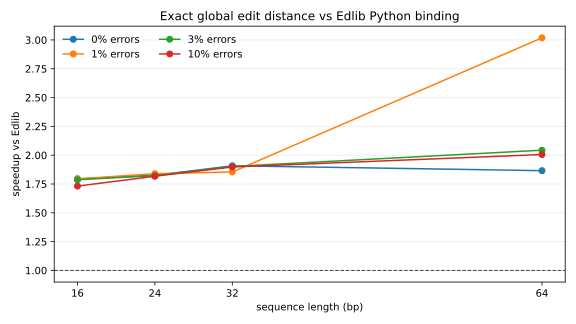
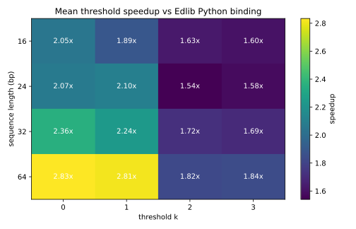
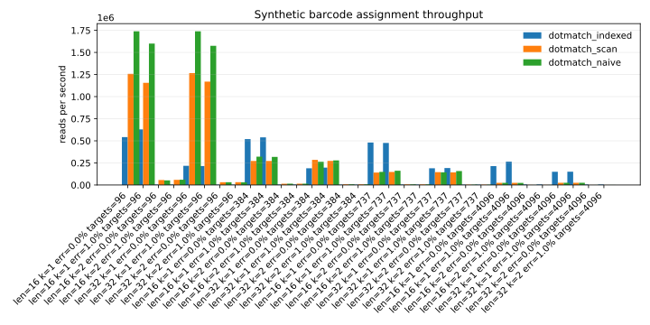

# Benchmarks

- Platform: `macOS-26.2-arm64-arm-64bit`
- Python: `3.9.6`
- External exact edit-distance baseline: Edlib Python binding with `mode="NW"`, `task="distance"`.
- These graphs cover short global edit-distance workloads.

## Benchmark Summary

- Core engine: deterministic short-DNA assignment with explicit `unique`, `ambiguous`, `none`, and `invalid` outcomes.
- Assignment throughput: indexed fixed-window rows reach multi-million-read/sec cases in the regenerated native and batch benchmarks, with zero assignment mismatches in native Edlib validation.
- Public assay evidence: CRISPR, barcode, BCL, feature-barcode, amplicon, oligo/adapter, and perturb-seq reports are generated from raw command artifacts and gated by scope-specific checks.
- Comparator scope: guide-counter, MAGeCK, Cutadapt-style, exact-slice, Edlib, exact-hash, and BK-tree comparators are reported where semantics are comparable; speed ratios are evidence, not universal replacement claims.

## Graphs

## Workflow Reports

- [Evidence gallery and report examples](../evidence-gallery/README.md)
- [Native Edlib assignment report](native/README.md)
- [Experimental GPU acceleration report](gpu/README.md)
- [Public CRISPR guide-counting report](public_crispr/README.md)
- [CRISPR multi-dataset comparison report](crispr_comparison/README.md)
- [Barcode demultiplexing report](barcode_demux/README.md)
- [Raw BCL demultiplexing report](bcl_demux/README.md)
- [Oligo/adapter public prefix-assignment report](oligo_adapter/README.md)
- [GSE146194 multi-guide direct-capture Perturb-seq case study](perturb_seq_gse146194/README.md)
- [Perturb-seq/CRISPR guide-capture public assignment report](perturb_seq/README.md)
- [Feature-barcode public assignment report](feature_barcode/README.md)
- [Amplicon/panel public primer-start assignment report](amplicon_panel/README.md)

Assay-lane coverage and public-evidence gaps are tracked in `docs/assay-evidence.json` and checked by `make assay-evidence-ready`. The gate inspects the listed raw CSV artifacts for data rows, command and exit-code provenance where present, and zero validation mismatch fields where recorded.

## Exact Distance Mean Speedup

| len | speedup_vs_edlib |
| --- | --- |
| 16 | 1.78 |
| 24 | 1.83 |
| 32 | 1.89 |
| 64 | 2.23 |

## Threshold Best Cases

| len | k | err | dotmatch_ns | edlib_ns | speedup_vs_edlib |
| --- | --- | --- | --- | --- | --- |
| 64 | 1 | 0.00 | 850.30 | 2713.20 | 3.19 |
| 64 | 0 | 0.00 | 851.20 | 2690.10 | 3.16 |
| 64 | 1 | 0.01 | 892.30 | 2667.50 | 2.99 |
| 64 | 1 | 0.03 | 857.20 | 2522.80 | 2.94 |
| 64 | 0 | 0.01 | 907.50 | 2590.90 | 2.85 |
| 64 | 0 | 0.03 | 856.50 | 2304.80 | 2.69 |
| 64 | 0 | 0.10 | 817.70 | 2150.00 | 2.63 |
| 32 | 0 | 0.00 | 812.30 | 1992.00 | 2.45 |

## Batch Assignment Top Throughput Rows

| tool | len | k | n_targets | reads_per_sec |
| --- | --- | --- | --- | --- |
| dotmatch_indexed | 8 | 0 | 96 | 18181679.7 |
| dotmatch_indexed | 8 | 0 | 384 | 10818699.2 |
| dotmatch_indexed | 8 | 0 | 4096 | 10000011.2 |
| dotmatch_indexed | 8 | 0 | 737 | 9429805.2 |
| dotmatch_indexed | 12 | 0 | 96 | 8545456.2 |
| dotmatch_indexed | 12 | 0 | 384 | 8333310.3 |
| dotmatch_indexed | 12 | 0 | 4096 | 7549866.5 |
| dotmatch_indexed | 12 | 0 | 737 | 7549866.5 |
| dotmatch_indexed | 16 | 0 | 384 | 6350805.1 |
| dotmatch_indexed | 16 | 0 | 737 | 6249997.9 |
| dotmatch_indexed | 16 | 0 | 96 | 5670499.8 |
| dotmatch_indexed | 16 | 0 | 4096 | 5634914.7 |

## Scope

These results cover short-DNA global edit-distance and threshold matching against Edlib's Python binding.
Native-library comparator records are tracked in `docs/benchmarks/native/README.md` and `docs/native-comparator-scope.md`.
