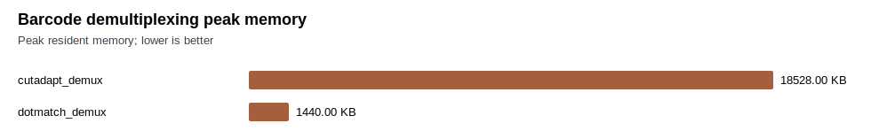
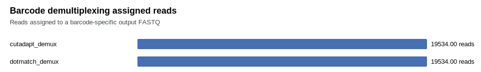

# Barcode Demultiplexing Benchmark

This report is the barcode-demultiplexing evidence track. It is separate from the CRISPR guide-counting report.

Current status: DotMatch now has a native `demux` command for fixed-position inline barcodes. A state-of-the-art barcode claim requires real public barcode datasets plus competitor rows, not only the built-in fixture.

## Figures

## Raw Rows

| tool | workflow | semantics | repeats | reads | barcodes | k | metric | mean seconds | mean reads/sec | peak RSS KB | assigned | ambiguous | unmatched | verified/read | cv | exit |
| --- | --- | --- | ---: | ---: | ---: | ---: | --- | ---: | ---: | ---: | ---: | ---: | ---: | ---: | ---: | ---: |
| cutadapt_demux | synthetic_inline_barcode_fixture | anchored_cutadapt_demux_no_indels | 2 | 20000 | 4 | 1 | hamming | 0.675660 | 66850.9 | 18528 | 19534 |  | 466 |  | 1.0557 | 0 |
| dotmatch_demux | synthetic_inline_barcode_fixture | fixed_position_unique_ambiguous_nomatch | 2 | 20000 | 4 | 1 | hamming | 0.021798 | 918505.2 | 1440 | 19534 | 0 | 466 | 0.0932 | 0.0471 | 0 |

## Publication Gate

Do not describe DotMatch as barcode state of the art until this table includes real public barcode workloads and fair competitor rows, at minimum Cutadapt. Additional fair comparators should include Ultraplex, Je, deML, sabre/fastx-style splitters, and Illumina demux tools where their input model matches the benchmark.

Suggested real-data starting point: SRP009896 / SRR391079-SRR391082, a maize GBS dataset described in public Cutadapt demultiplexing examples as 5-prime inline barcode reads with 96 demultiplexed outputs.
