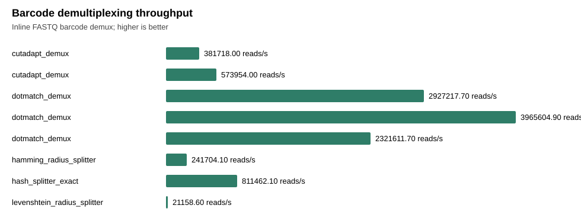
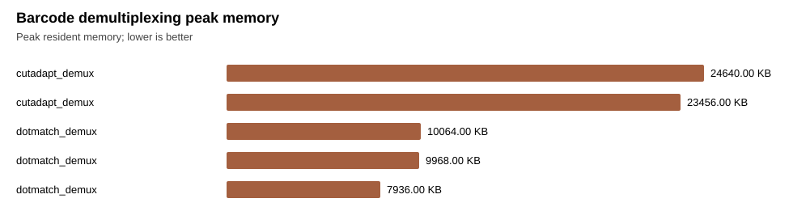
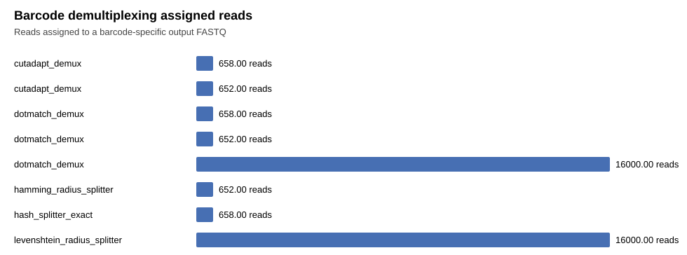

# Barcode Demultiplexing Benchmark

This report is the barcode-demultiplexing evidence track. It is separate from the CRISPR guide-counting report.

Current status: DotMatch has checked public SRP009896/SRR391079 inline-barcode lanes with five repeats: the variable-length exact-prefix lane, plus a fixed-length 8 bp one-mismatch Hamming lane. Comparator rows include Cutadapt anchored no-indel demux, an exact hash-splitter baseline for k=0, and a transparent Hamming-radius splitter for k=1 agreement. The report also includes a synthetic fixed-length one-edit Levenshtein fixture that exercises exact, substitution, deletion, insertion, and unmatched reads against an independent transparent oracle. Broader barcode-demultiplexing claims require additional public datasets and comparator semantics, not only these lanes.

`hash_splitter_exact` is a transparent exact-prefix baseline. `hamming_radius_splitter` is a transparent fixed-length Hamming-radius oracle that records exact, corrected, ambiguous, and unmatched reads for the public k=1 barcode lane. `levenshtein_radius_splitter` is a transparent one-edit oracle for the synthetic fixture; it validates that the direct Levenshtein demux path assigns substitution, deletion, and insertion cases consistently, but it is not public real-data evidence.

## Figures

## Raw Rows

| tool | workflow | semantics | repeats | reads | barcodes | k | metric | engine | mean seconds | mean reads/sec | peak RSS KB | assigned | corrected | ambiguous | unmatched | verified/read | cv | exit |
| --- | --- | --- | ---: | ---: | ---: | ---: | --- | --- | ---: | ---: | ---: | ---: | ---: | ---: | ---: | ---: | ---: | ---: |
| cutadapt_demux | real_srp009896_inline_barcode | anchored_cutadapt_demux_no_indels | 5 | 100000 | 48 | 0 | hamming |  | 0.264610 | 381718.0 | 24640 | 658 |  |  | 99342 |  | 0.1046 | 0 |
| cutadapt_demux | real_srp009896_inline_barcode_fixed8_k1 | anchored_cutadapt_demux_no_indels | 5 | 100000 | 10 | 1 | hamming |  | 0.174248 | 573954.0 | 23456 | 652 |  |  | 99348 |  | 0.0113 | 0 |
| dotmatch_demux | real_srp009896_inline_barcode | fixed_position_unique_ambiguous_nomatch | 5 | 100000 | 48 | 0 | hamming | generic_indexed | 0.034194 | 2927217.7 | 10064 | 658 | 0 | 0 | 99342 | 0.0066 | 0.0342 | 0 |
| dotmatch_demux | real_srp009896_inline_barcode_fixed8_k1 | fixed_position_unique_ambiguous_nomatch | 5 | 100000 | 10 | 1 | hamming | hamming_k1_lookup_direct | 0.025233 | 3965604.9 | 9968 | 652 | 647 | 0 | 99348 | 0.0065 | 0.0277 | 0 |
| dotmatch_demux | synthetic_levenshtein_one_edit_fixture | fixed_position_unique_ambiguous_nomatch | 5 | 20000 | 4 | 1 | levenshtein | levenshtein_k1_lookup_direct | 0.008667 | 2321611.7 | 7936 | 16000 | 12000 | 0 | 4000 | 1.0000 | 0.0897 | 0 |
| hamming_radius_splitter | real_srp009896_inline_barcode_fixed8_k1 | transparent_hamming_radius_unique_demux | 5 | 100000 | 10 | 1 | hamming |  | 0.413814 | 241704.1 |  | 652 | 647 | 0 | 99348 |  | 0.0160 | 0 |
| hash_splitter_exact | real_srp009896_inline_barcode | longest_unique_exact_prefix_no_mismatch | 5 | 100000 | 48 | 0 | exact |  | 0.123334 | 811462.1 |  | 658 |  |  | 99342 |  | 0.0317 | 0 |
| levenshtein_radius_splitter | synthetic_levenshtein_one_edit_fixture | transparent_levenshtein_radius_unique_demux | 5 | 20000 | 4 | 1 | levenshtein |  | 0.945255 | 21158.6 |  | 16000 | 12000 | 0 | 4000 |  | 0.0040 | 0 |

## Gated Real-Data Speedups

| workflow | comparator | DotMatch reads/sec | comparator reads/sec | speedup | gate floor |
| --- | --- | ---: | ---: | ---: | ---: |
| real_srp009896_inline_barcode | cutadapt_demux | 2927217.7 | 381718.0 | 7.67x | 5.00x |
| real_srp009896_inline_barcode | hash_splitter_exact | 2927217.7 | 811462.1 | 3.61x | 3.00x |
| real_srp009896_inline_barcode_fixed8_k1 | cutadapt_demux | 3965604.9 | 573954.0 | 6.91x | 5.00x |
| real_srp009896_inline_barcode_fixed8_k1 | hamming_radius_splitter | 3965604.9 | 241704.1 | 16.41x | 12.00x |

## Comparison Evidence Gate

`make barcode-comparison-gate` passes for the SRP009896/SRR391079 rows shown above. The checked public comparison is narrow: Cutadapt is run as an anchored no-indel demultiplexer after trimming the leading `N`; `hash_splitter_exact` covers the exact-prefix lane; and `hamming_radius_splitter` validates the fixed-length k=1 Hamming lane against an independent transparent implementation. The strict gate requires the real k=0 lane to beat Cutadapt by at least 5.0x and the exact hash splitter by at least 3.0x; it requires the real fixed-length k=1 Hamming lane to beat Cutadapt by at least 5.0x and the Hamming-radius splitter by at least 12.0x. The smoke gate also checks the synthetic Levenshtein fixture rows and requires DotMatch to report the `levenshtein_k1_lookup_direct` assignment engine there.

Suggested real-data starting point: SRP009896 / SRR391079-SRR391082, a maize GBS dataset described in public Cutadapt demultiplexing examples as 5-prime inline barcode reads with 96 demultiplexed outputs. `scripts/fetch_srp009896_barcode_demo.py --use-public-example-barcodes` extracts the first-member barcode sheet from the public Google Drive example archive with a ranged request instead of downloading the full 7.4 GB ZIP, then filters rows to the requested accession when the run column is present.

Important boundary: the SRP009896 barcode sheet contains variable-length barcodes (`4-8 bp`) and reused barcode sequences across run blocks. It also reuses labels such as `Blank` for distinct barcode sequences, so the benchmark writes a local barcode table with stable unique IDs before invoking tools that require unique output names. SRP009896 reads include a leading `N`; the exact-prefix lane uses `--barcode-start 1 --barcode-length auto --k 0`, while the public one-edit lane filters the sheet to its fixed 8 bp subset and uses `--barcode-start 1 --barcode-length 8 --k 1` with Hamming semantics. The Levenshtein indel lane is fixture evidence until a public fixed-length indel barcode dataset and matching production comparator are available.
