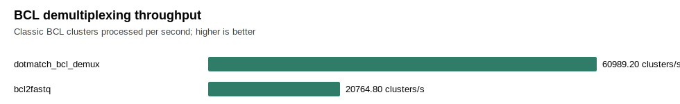
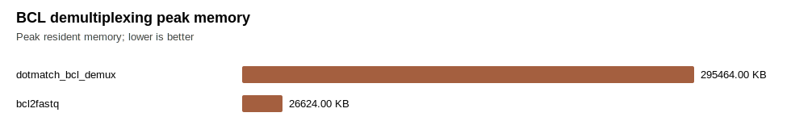
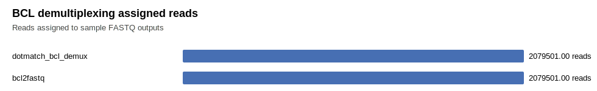

# BCL Demultiplexing Benchmark

This is the raw Illumina run-folder barcode demultiplexing evidence track.

Current status: DotMatch supports a first lane-1 classic per-cycle BCL milestone. CBCL/NovaSeq-style input and broader multi-lane BCL operation are still gated as future work. Comparative wording requires real run folders and zero-mismatch validation against BCL Convert or bcl2fastq where available.

The public `public_10x_tiny_bcl` row uses the 10x Genomics Cell Ranger `tiny-bcl` mkfastq demo run folder. The bundled fetch script downloads the 10x sample sheet, the public run-folder archive, and the official Chromium i7 index CSV used to normalize the legacy `SI-P03-C9` index-set alias into concrete index sequences.

Rows with exit code `127` are environment records for missing competitors, not runtime comparisons. They are kept in the raw table so the report is explicit about what was unavailable on this machine.

## Current Best Validated Comparison

Within this CSV, the fastest DotMatch row has 2.94x higher throughput than the fastest validated installed comparator row (bcl2fastq) on the same host and workflow.

This is not a comparison result by itself: the comparison gate still requires distinct repeated real runs, a successful DotMatch CBCL row, validated competitor rows, and stricter output validation where read names/paths are comparable.

## Figures

## Raw Rows

| tool | workflow | format | clusters | cycles | samples | threads | gzip | seconds | clusters/sec | peak RSS KB | output MB | assigned | undetermined | filtered | validation | mode | content hash | exit | logs |
| --- | --- | --- | ---: | ---: | ---: | ---: | ---: | ---: | ---: | ---: | ---: | ---: | ---: | ---: | ---: | --- | --- | ---: | --- |
| dotmatch_bcl_demux | public_10x_tiny_bcl | classic_bcl | 2136539 | 132 | 1 | 2 | 1 | 35.031440 | 60989.2 | 295464 | 200.06 | 2079501 | 57038 | 0 |  |  | 2f4c38035535 | 0 | ../../../../../../../../root/dotmatch/benchmarks/work/bcl_demux/logs/dotmatch_bcl_demux.stderr.log |
| bcl-convert | public_10x_tiny_bcl | classic_bcl_or_cbcl | 2136539 | 132 | 1 |  |  | 0.040387 | 0.0 | 11392 | 0.00 | 0 | 0 |  |  |  |  | 1 | ../../../../../../../../root/dotmatch/benchmarks/work/bcl_demux/logs/bcl_convert.stderr.log |
| bcl2fastq | public_10x_tiny_bcl | classic_bcl | 2136539 | 132 | 1 |  | 1 | 102.892265 | 20764.8 | 26624 | 220.48 | 2079501 | 57038 |  | 0 | count_totals | 19db924c3892 | 0 | ../../../../../../../../root/dotmatch/benchmarks/work/bcl_demux/logs/bcl2fastq.stderr.log |
| cuda-demux | public_10x_tiny_bcl | classic_bcl_or_cbcl | 2136539 | 132 | 1 |  |  | 0.000000 | 0.0 | 0 |  |  |  |  |  |  |  | 127 |  |

## Evidence Gates

Run `make bcl-tiny-public-gate` to verify the narrow public 10x tiny-BCL classic per-cycle milestone. This gate checks the committed DotMatch row, output hashes, count totals, and available bcl2fastq count-total validation.

Broader raw-BCL comparative wording requires real classic-BCL and CBCL run-folder rows, a successful DotMatch CBCL row, competitor rows for BCL Convert/bcl2fastq/CUDA-Demux where installable, distinct repeated timing, and `dotmatch bcl-validate` zero-mismatch evidence.

Run `make bcl-comparison-gate` before using comparative wording. The gate intentionally fails on synthetic or tiny rows, missing DotMatch CBCL evidence, missing distinct repeats, missing competitor rows, failed validation, or slower DotMatch throughput.
