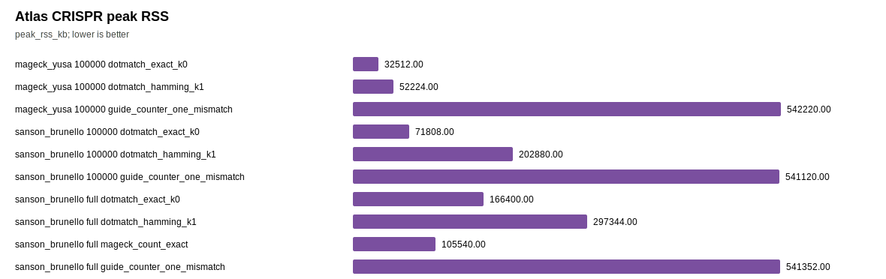

# Atlas CRISPR Progress

This report is intentionally not a SOTA claim. It summarizes the latest atlas real-data rows after the direct Hamming path, fused offset detection, block gzip reader, exact-only k=0 index, compact Hamming hash table, adaptive seed/precompute strategy, FASTQ length-return reader, and reserved sampling buffer work.

## Current Read

- Yusa Hamming k=1 speedup vs guide-counter on the 100k/sample row: **7.24x**.
- Sanson/Brunello Hamming k=1 speedup vs guide-counter on the 100k/sample row: **2.26x**.
- Sanson/Brunello Hamming k=1 speedup vs guide-counter on the full 246.95M-read row: **1.28x**.
- The full Sanson row is the serious stress test. It is useful evidence, but it is not 10x.
- DotMatch uses less memory than guide-counter in these rows, but the current 2-vCPU atlas host limits how much memory-efficient parallelism can be demonstrated.

## Figures

## Rows

|dataset_id|run_level|requested_records_per_sample|tool|n_reads|seconds|reads_per_sec|peak_rss_kb|assigned_reads|corrected_reads|ambiguous_reads|verified_per_read|
|---|---|---|---|---|---|---|---|---|---|---|---|
|mageck_yusa|subsample|100000|dotmatch_exact_k0|200000|0.432223|462723.8|32512|178715|0|0|0.8936|
|mageck_yusa|subsample|100000|dotmatch_hamming_k1|200000|0.790966|252855.4|52224|184167|5452|5|0.9962|
|mageck_yusa|subsample|100000|guide_counter_one_mismatch|200000|5.729837|34905.0|542220|208700||||
|sanson_brunello|subsample|100000|dotmatch_exact_k0|400000|2.726463|146710.2|71808|321536|0|200|0.8049|
|sanson_brunello|subsample|100000|dotmatch_hamming_k1|400000|2.687481|148838.3|202880|348665|27129|258|0.8730|
|sanson_brunello|subsample|100000|guide_counter_one_mismatch|400000|6.080727|65781.6|541120|350374||||
|sanson_brunello|full|full|dotmatch_exact_k0|246950411|462.012330|534510.4|166400|205995182|0|113059|0.8351|
|sanson_brunello|full|full|dotmatch_hamming_k1|246950411|485.241981|508922.2|297344|222782347|16787165|143731|0.9033|
|sanson_brunello|full|full|mageck_count_exact|246950411|1110.129602|222451.9|105540|28|0|||
|sanson_brunello|full|full|guide_counter_one_mismatch|246950411|620.861898|397754.2|541352|223958162||||

## Gate Status

**CRISPR SOTA/10x gate: fail.** The data show real utility and some speed/memory wins, but not a defensible 10x claim against guide-counter on the full Sanson/Brunello workload.
