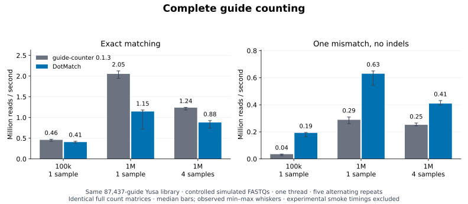
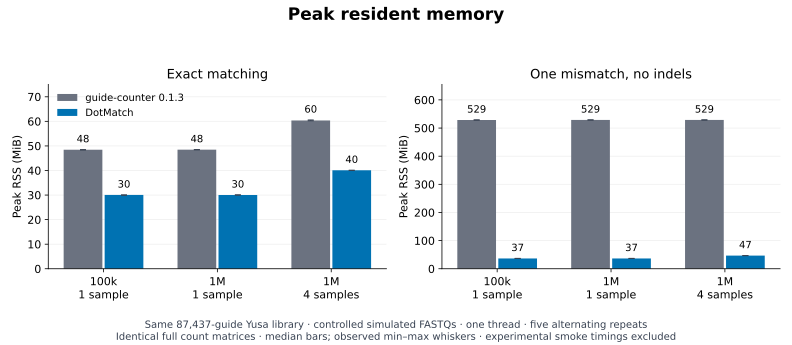

# DotMatch versus guide-counter

**DotMatch is 1.6–5.5× faster with 11.3–14.4× lower peak memory in the tested one-mismatch workflows.**

These are complete single-thread counting commands against the same 87,437-guide Yusa library, with identical full guide/sample count matrices. The performance workloads use controlled simulated FASTQs with 100,000 or 1,000,000 reads. They measure counting performance under the recorded conditions; they do not establish genome-wide biological accuracy or performance on full experimental screens.

The benchmarked source includes the compatibility fixes and optimizations described here. Measurements apply to the recorded source and binary hashes; they do not benchmark a published wheel.

## Complete-command throughput



Bars show median throughput; whiskers show the observed minimum and maximum across five fresh processes. Exact and one-mismatch modes are reported separately. All timings include library/index construction, offset detection, gzip parsing, counting, and the count, extended-count and statistics files.

| Reads / samples | Mode | DotMatch seconds | guide-counter seconds | Paired speedup, median [min–max] |
| --- | --- | --- | --- | --- |
| 100k / 1 sample | Exact | 0.246 | 0.217 | 0.90× [0.86–0.98] |
| 100k / 1 sample | One mismatch | 0.520 | 2.857 | 5.55× [4.57–8.36] |
| 1M / 1 sample | Exact | 0.873 | 0.487 | 0.54× [0.37–0.59] |
| 1M / 1 sample | One mismatch | 1.588 | 3.460 | 2.14× [1.89–2.42] |
| 1M / 4 samples | Exact | 1.136 | 0.808 | 0.72× [0.60–0.74] |
| 1M / 4 samples | One mismatch | 2.445 | 3.968 | 1.62× [1.53–1.76] |

Speedups are medians of within-repeat guide-counter/DotMatch runtime ratios. Guide-counter is faster in the recorded exact-mode million-read comparisons; the one-mismatch headline does not apply to exact mode.

## Peak memory



Memory is per-command peak resident set size from a fresh native launcher and `wait4`, converted from KiB to MiB. The launcher prevents the benchmark Python process’s validation heap from inflating child memory. Bars show medians and whiskers show the five-run range.

| Reads / samples | Mode | DotMatch maximum MiB | guide-counter maximum MiB | Paired median memory ratio |
| --- | --- | --- | --- | --- |
| 100k / 1 sample | Exact | 30.0 | 48.5 | 1.61× |
| 100k / 1 sample | One mismatch | 36.7 | 528.7 | 14.42× |
| 1M / 1 sample | Exact | 30.0 | 48.5 | 1.61× |
| 1M / 1 sample | One mismatch | 36.7 | 528.7 | 14.43× |
| 1M / 4 samples | Exact | 40.1 | 60.6 | 1.51× |
| 1M / 4 samples | One mismatch | 46.8 | 528.7 | 11.32× |

## What changed

The compatibility entrypoint now matches guide-counter’s counting rules for supported ACGT libraries of 1–32 bases:

- Offset detection uses the same exact/one-mismatch lookup as counting.
- Offset fractions use all matched windows as their denominator; offsets with zero matches are excluded, and no match means no fallback offset.
- Each selected offset is counted independently. One read may therefore contribute more than one guide count.
- Offset fractions retain full double precision through CLI forwarding; boundary regressions cover values immediately below, equal to and above 0.5.
- Uppercase ACGT read windows are required. Windows containing `N`, IUPAC bytes or lowercase bases are excluded in this entrypoint.
- Exact hits take precedence; equal-distance ties are excluded.

The implementation uses two packed Hamming seeds to find possible distance-one targets, verifies their full packed distance, and avoids materializing every possible mutated guide. Rolling offset encoding and table-based base decoding reduce repeated work. The library is parsed once, and all three outputs are written directly from the count matrix.

Ordinary `dotmatch count` retains its own documented policies, including literal unknown-byte matching. For guide-counter comparisons use the compatibility entrypoint and explicit shared offset parameters.

## Count agreement and experimental smoke check

All 80 recorded commands completed successfully. Every guide/sample count agrees across tools and repeats, as do guide annotations, extended counts and numerical statistics. Differences in floating-point text formatting are allowed; integer counts are exact.

Independent byte-oracle regressions cover offset detection, threshold boundaries, exact priority, ties, multiple windows, unknown/lowercase rejection, empty inputs, and guide lengths 1, 19, 20 and 32. Duplicate guide sequences are rejected.

The cached ERR376998/ERR376999 experimental prefixes contain 25 and 25 reads. Their full count matrices agree in both modes. This small check verifies compatibility; its timings are excluded from the headline and figures because startup dominates. It is not a full experimental-read performance benchmark.

Earlier guide-counter-style comparisons in [the historical public CRISPR report](../crispr_comparison/README.md) used another counting path and reported count differences. This corrected compatibility benchmark is separate; those earlier results have not been relabeled as agreeing.

## Protocol and provenance

- Controlled recipe: 50-base uppercase ACGT reads; uniformly sampled library guides at offsets 23, 24 or 25; 70% exact, 20% one substitution, 5% two substitutions, 5% random decoys. Construction labels are not guaranteed biological source identities.
- Read sets: 100,000 in one FASTQ; 1,000,000 in one FASTQ; 1,000,000 across four FASTQs. Generation seeds and input hashes are frozen in the JSON protocol.
- Offset sample: first 100,000 reads per FASTQ, or the whole file when shorter; minimum matched-window fraction 0.0025.
- Five paired repeats alternate tool order. Both tools run one thread. Inputs are reused from the local filesystem; cache flushing and cold-storage performance are not measured.
- Fresh processes include startup and indexing. Generation, output checks and plotting are outside the timed region.
- Competitor: unmodified [guide-counter 0.1.3 source](https://github.com/fulcrumgenomics/guide-counter/tree/f24de175282064773328e35baf03373e7e3b895d), commit `f24de175282064773328e35baf03373e7e3b895d`; locked release build with upstream fat LTO and one codegen unit.
- Toolchain: `rustc 1.95.0 (59807616e 2026-04-14)`; `cc (Debian 14.2.0-19) 14.2.0`. DotMatch uses its default `-O3` build and `-mavx2` on this x86-64 host.
- Host: `Linux-6.18.44-x86_64-with-glibc2.41`; CPU `INTEL(R) XEON(R) PLATINUM 8573C`. Container scheduling and shared-host load remain sources of timing variation.

## Reproduce

Build the pinned competitor without modifying its source. Use Rust 1.95.0 for the recorded build:

```bash
git clone https://github.com/fulcrumgenomics/guide-counter.git benchmarks/work/guide-counter-source
git -C benchmarks/work/guide-counter-source checkout f24de175282064773328e35baf03373e7e3b895d
cargo build --release --locked --manifest-path benchmarks/work/guide-counter-source/Cargo.toml
python3 scripts/fetch_mageck_demo.py --out benchmarks/real/data --subsample 25
make dotmatch CC=cc
python3 scripts/bench_guide_counter.py \
  --guide-counter benchmarks/work/guide-counter-source/target/release/guide-counter \
  --guide-counter-source benchmarks/work/guide-counter-source \
  --rustc "$(command -v rustc)" \
  --sizes 100000,1000000 --repeats 5 \
  --experimental-fastq benchmarks/real/data/ERR376998.fastq.gz \
  --experimental-fastq benchmarks/real/data/ERR376999.fastq.gz
python3 scripts/report_guide_counter.py
python3 scripts/report_guide_counter.py --check --check-source
make test cli-test guide-counter-gate
```

For an existing protocol, pass `--reuse-inputs` with the same `--work-dir`; all input hashes are checked before reuse. Do not run another benchmark or CPU-intensive test suite concurrently with timing.

Raw [timings and agreement](https://github.com/dnncha/dotmatch/blob/main/benchmarks/raw/guide_counter_comparison.csv), [source/input protocol](https://github.com/dnncha/dotmatch/blob/main/benchmarks/raw/guide_counter_comparison.json), and [audit/figure hashes](https://github.com/dnncha/dotmatch/blob/main/benchmarks/raw/guide_counter_comparison_validation.json) are retained. SVG, PNG and PDF versions of both figures are available under `benchmarks/figures/`.

## Limits and next validation

This comparison covers one public library, a fixed controlled error mixture, two read scales and one/four samples on one host. More reads amortize guide-counter’s index construction, so the ratio can change substantially for full screens. Results do not cover indels, arbitrary regex compatibility, guides longer than 32 bases, full experimental FASTQs or biological gene-hit accuracy. A lower runtime or more assigned windows is not evidence of better biological inference.

Larger experimental Yusa and Sanson/Brunello FASTQs remain the next benchmark. Downloads from ENA were blocked by this cloud environment’s host policy during this run; the required host additions were saved for review. The available 25-read prefixes have not been expanded or presented as full screens.
