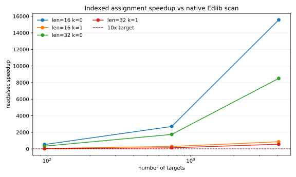
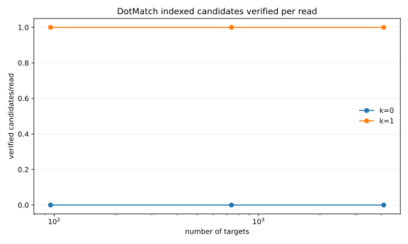
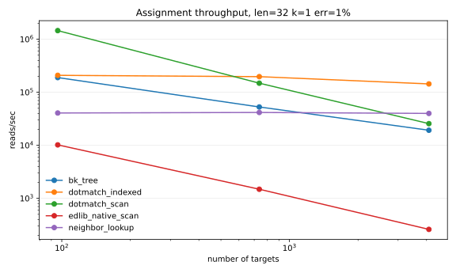

# Native Edlib Benchmark Report

- Platform: `macOS-26.2-arm64-arm-64bit`
- Python: `3.9.6`
- Reads per benchmark case: `500`
- Repetitions per benchmark case: `3`
- Comparator: native Edlib C/C++ API, `EDLIB_MODE_NW`, `EDLIB_TASK_DISTANCE`, fixed threshold `k`.
- Additional baselines: exact hash lookup for `k=0`; BK-tree and neighbor lookup approximate baselines for `k=1`.
- Gate: `make native-exact-gate` requires zero mismatches, large-library exact rows to beat `exact_hash_lookup`, large-library indexed `k=1` rows to beat exhaustive Edlib by >10x, beat the best BK-tree/neighbor baseline, and verify no more than 1.05 candidates/read, plus large-library `k=2` substitution rows to beat exhaustive Edlib by >8x with no more than 1.05 verified candidates/read and Levenshtein `k=2` insertion/deletion rows to beat exhaustive Edlib by >8x while verifying no more than 25 candidates/read.
- Assignment mismatches recorded across all rows: `0`.
- Every benchmark run aborts on assignment disagreement between DotMatch and native Edlib scan.

## Gated Native Scaling Claims

| claim | large_library_rows | min_speedup_vs_edlib | median_speedup_vs_edlib | max_verified_per_read | min_speedup_required | max_verified_required |
| --- | --- | --- | --- | --- | --- | --- |
| k=1 substitution indexed rows | 36 | 790.91 | 1160.80 | 1.00 | 10.00 | 1.05 |
| k=2 substitution indexed rows | 36 | 8.91 | 17.45 | 1.00 | 8.00 | 1.05 |
| Levenshtein k=2 insertion/deletion rows | 18 | 8.08 | 13.00 | 1.00 | 8.00 | 25.00 |

## Highest Observed Microbenchmark Speedups

| dotmatch_tool | n_targets | len | k | error_mode | err | reads_per_sec_dotmatch | reads_per_sec_edlib | verified_per_read | peak_rss_kb | speedup_vs_edlib_native |
| --- | --- | --- | --- | --- | --- | --- | --- | --- | --- | --- |
| dotmatch_exact_direct | 4096 | 16 | 0 | exact | 0.000 | 13513538.20 | 943.30 | 1.00 | 9888.00 | 14714.22 |
| dotmatch_exact_batch | 4096 | 16 | 0 | one_substitution | 0.010 | 13513495.70 | 940.20 | 0.00 | 10128.00 | 14535.76 |
| dotmatch_exact_batch | 4096 | 16 | 0 | one_substitution | 0.000 | 13157875.20 | 946.80 | 0.00 | 10128.00 | 14347.26 |
| dotmatch_exact_batch | 4096 | 16 | 0 | one_substitution | 0.030 | 13513495.70 | 940.00 | 0.00 | 10128.00 | 14174.00 |
| dotmatch_exact_direct | 4096 | 16 | 0 | one_substitution | 0.005 | 13157915.50 | 941.00 | 0.00 | 10128.00 | 14147.29 |
| dotmatch_exact_batch | 4096 | 24 | 0 | exact | 0.000 | 9615376.00 | 874.50 | 1.00 | 11984.00 | 10995.31 |
| dotmatch_exact_batch | 4096 | 24 | 0 | one_substitution | 0.010 | 9433973.30 | 876.20 | 0.00 | 14464.00 | 10766.92 |
| dotmatch_exact_batch | 4096 | 24 | 0 | one_substitution | 0.000 | 9259268.60 | 873.00 | 0.00 | 14448.00 | 10623.30 |
| dotmatch_exact_batch | 4096 | 24 | 0 | one_substitution | 0.030 | 9259248.60 | 876.40 | 0.00 | 14464.00 | 10565.09 |
| dotmatch_exact_direct | 4096 | 24 | 0 | one_substitution | 0.005 | 9259248.60 | 877.00 | 0.00 | 14464.00 | 10557.89 |
| dotmatch_exact_batch | 4096 | 32 | 0 | one_substitution | 0.030 | 7352935.50 | 820.60 | 0.00 | 19328.00 | 8960.44 |
| dotmatch_exact_batch | 4096 | 32 | 0 | one_substitution | 0.005 | 7246382.80 | 821.80 | 0.00 | 19328.00 | 8861.91 |

## Median Speedup Summary

| len | k | n_targets | error_mode | speedup_vs_edlib_native |
| --- | --- | --- | --- | --- |
| 16 | 0 | 4096 | exact | 14714.22 |
| 16 | 0 | 4096 | one_substitution | 14355.12 |
| 24 | 0 | 4096 | exact | 10995.31 |
| 24 | 0 | 4096 | one_substitution | 10614.78 |
| 32 | 0 | 4096 | one_substitution | 8716.42 |
| 32 | 0 | 4096 | exact | 8663.13 |
| 16 | 0 | 737 | exact | 3251.34 |
| 16 | 0 | 737 | one_substitution | 2667.38 |
| 24 | 0 | 737 | exact | 2386.00 |
| 24 | 0 | 737 | one_substitution | 2116.58 |
| 32 | 0 | 737 | exact | 1921.31 |
| 16 | 1 | 4096 | exact | 1861.95 |

## Repeated-Run Statistics

| tool | error_mode | n_targets | len | k | err | reads_per_sec_mean | reads_per_sec_p50 | reads_per_sec_p95 | reads_per_sec_cv | peak_rss_kb_max | mismatches_sum |
| --- | --- | --- | --- | --- | --- | --- | --- | --- | --- | --- | --- |
| dotmatch_exact_batch | exact | 4096 | 16 | 0 | 0.000 | 13433100.10 | 13513538.20 | 14208527.11 | 0.07 | 9888.00 | 0.00 |
| dotmatch_exact_batch | exact | 4096 | 24 | 0 | 0.000 | 9554908.70 | 9615376.00 | 9615395.35 | 0.01 | 11984.00 | 0.00 |
| dotmatch_exact_batch | exact | 4096 | 32 | 0 | 0.000 | 7045981.87 | 7042257.60 | 7225959.21 | 0.03 | 18992.00 | 0.00 |
| dotmatch_exact_batch | exact | 737 | 16 | 0 | 0.000 | 16487456.27 | 16666669.10 | 16666669.10 | 0.02 | 3200.00 | 0.00 |
| dotmatch_exact_batch | exact | 737 | 24 | 0 | 0.000 | 11316437.77 | 11627912.90 | 11877054.86 | 0.07 | 10944.00 | 0.00 |
| dotmatch_exact_batch | exact | 737 | 32 | 0 | 0.000 | 8824142.83 | 8771934.70 | 8912896.66 | 0.01 | 14816.00 | 0.00 |
| dotmatch_exact_batch | exact | 96 | 16 | 0 | 0.000 | 20728472.00 | 25000100.70 | 26184185.34 | 0.41 | 1776.00 | 0.00 |
| dotmatch_exact_batch | exact | 96 | 24 | 0 | 0.000 | 21437178.57 | 21739074.90 | 21739173.99 | 0.02 | 10848.00 | 0.00 |
| dotmatch_exact_batch | exact | 96 | 32 | 0 | 0.000 | 17446642.80 | 17241386.50 | 17795578.51 | 0.02 | 14784.00 | 0.00 |
| dotmatch_exact_batch | one_substitution | 4096 | 16 | 0 | 0.000 | 13289094.93 | 13157875.20 | 13815813.63 | 0.04 | 10128.00 | 0.00 |
| dotmatch_exact_batch | one_substitution | 4096 | 16 | 0 | 0.005 | 13276428.80 | 13157915.50 | 13477937.68 | 0.02 | 10128.00 | 0.00 |
| dotmatch_exact_batch | one_substitution | 4096 | 16 | 0 | 0.010 | 13638636.43 | 13513495.70 | 13851375.68 | 0.02 | 10128.00 | 0.00 |
| dotmatch_exact_batch | one_substitution | 4096 | 16 | 0 | 0.030 | 12884968.10 | 13513495.70 | 13513495.70 | 0.08 | 10128.00 | 0.00 |
| dotmatch_exact_batch | one_substitution | 4096 | 24 | 0 | 0.000 | 9440817.10 | 9259268.60 | 9749449.55 | 0.03 | 14448.00 | 0.00 |
| dotmatch_exact_batch | one_substitution | 4096 | 24 | 0 | 0.005 | 9046396.80 | 9259248.60 | 9259248.60 | 0.04 | 14464.00 | 0.00 |
| dotmatch_exact_batch | one_substitution | 4096 | 24 | 0 | 0.010 | 9442934.73 | 9433973.30 | 9766920.02 | 0.04 | 14464.00 | 0.00 |
| dotmatch_exact_batch | one_substitution | 4096 | 24 | 0 | 0.030 | 9203138.00 | 9259248.60 | 9259248.60 | 0.01 | 14464.00 | 0.00 |
| dotmatch_exact_batch | one_substitution | 4096 | 32 | 0 | 0.000 | 7226336.50 | 7042257.60 | 7627299.54 | 0.06 | 19328.00 | 0.00 |
| dotmatch_exact_batch | one_substitution | 4096 | 32 | 0 | 0.005 | 7375778.90 | 7246382.80 | 7867493.86 | 0.07 | 19328.00 | 0.00 |
| dotmatch_exact_batch | one_substitution | 4096 | 32 | 0 | 0.010 | 6977047.27 | 6944447.70 | 7032476.61 | 0.01 | 19328.00 | 0.00 |
| dotmatch_exact_batch | one_substitution | 4096 | 32 | 0 | 0.030 | 7087229.50 | 7042246.10 | 7420649.75 | 0.05 | 19328.00 | 0.00 |
| dotmatch_exact_batch | one_substitution | 737 | 16 | 0 | 0.000 | 13888873.00 | 13888873.00 | 13888873.00 | 0.00 | 3280.00 | 0.00 |
| dotmatch_exact_batch | one_substitution | 737 | 16 | 0 | 0.005 | 13909788.03 | 14285700.50 | 14285743.34 | 0.05 | 3280.00 | 0.00 |
| dotmatch_exact_batch | one_substitution | 737 | 16 | 0 | 0.010 | 13909788.03 | 14285700.50 | 14285743.34 | 0.05 | 3280.00 | 0.00 |

## Evidence Boundary

These are native Edlib scan microbenchmarks for exact short-DNA assignment workloads, plus simple exact-hash and BK-tree/neighbor baselines. The largest rows are useful for understanding algorithmic scaling against exhaustive scan, but they are not end-to-end workflow speed claims. Exact `k=0` lookup should be judged against hash-table baselines: broad exact-hash superiority is not claimed unless the exact gate proves it, while large-library exact rows (`n_targets >= 4096`) may be described only when `make native-exact-gate` records a >1.0 ratio against `exact_hash_lookup`. For `k=1`, large-library indexed rows may be described as non-exhaustive only when the same gate records zero Edlib disagreements, >10x speedup over exhaustive Edlib scan, >1.0 speedup over the best BK-tree/neighbor baseline, and no more than 1.05 verified candidates/read. Fixed-length `k=2` substitution rows may be described as non-exhaustive only when the same gate records zero Edlib disagreements, >8x speedup over exhaustive Edlib scan, and no more than 1.05 verified candidates/read. Levenshtein `k=2` insertion/deletion rows may be described as non-exhaustive only when the same gate records zero Edlib disagreements, >8x speedup over exhaustive Edlib scan, and no more than 25 verified candidates/read. This remains scoped to packed A/C/G/T fixed-window assignment up to 32 bases with fallback preserving semantics for unsupported cases.
