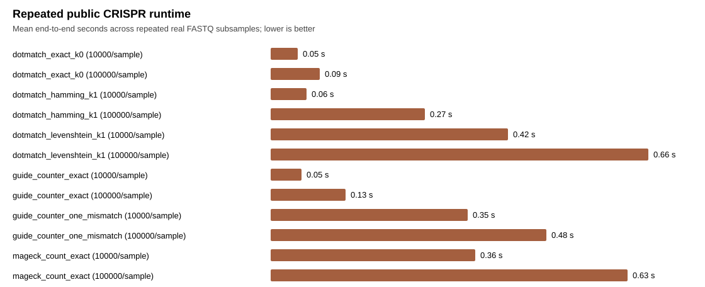
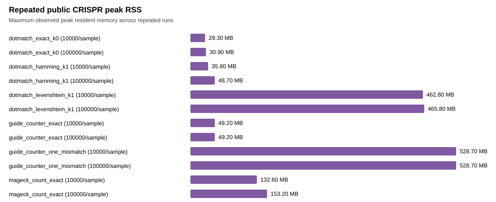
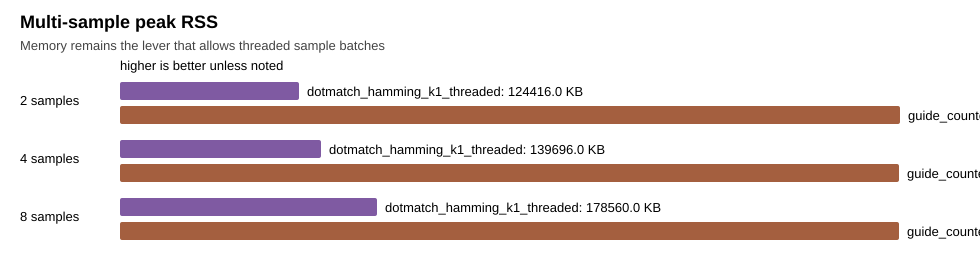

# Public CRISPR Workflow Comparator

This report tracks the MAGeCK/Yusa public CRISPR benchmark. The single-run table below is a smoke/latest wiring check only; repeated rows and comparison-gated rows are the only rows intended to support user-facing performance statements.

## Smoke/Latest Wiring Table

**Reduced evidence.** These rows are secondary benchmark context. Use the repeated-run statistics below, and use `docs/benchmarks/crispr_comparison/README.md` once `make crispr-comparison-gate` passes for two real CRISPR datasets.

| tool | version | semantics | n_reads | n_targets | seconds | reads_per_sec | peak_rss_kb | assigned_reads | corrected_reads | ambiguous_reads | rejected_reads | overcount_reads | verified_per_read | exit_code |
| --- | --- | --- | --- | --- | --- | --- | --- | --- | --- | --- | --- | --- | --- | --- |
| dotmatch_exact_k0 | local | exact_k0_no_errors | 20394663 | 87437 | 3.831934 | 5322290.4 | 31616 | 17091377 | 0 | 0 | 3303286 | 0 | 0.8380 | 0 |
| dotmatch_levenshtein_k1 | local | levenshtein_k1_substitution_insertion_deletion | 20394663 | 87437 | 7.039597 | 2897134.9 | 471392 | 18869012 | 1777635 | 30939 | 1494712 | 0 | 0.9383 | 0 |
| dotmatch_hamming_k1 | local | hamming_k1_no_indels | 20394663 | 87437 | 4.357828 | 4680006.0 | 44048 | 17929586 | 838209 | 683 | 2464394 | 0 | 1.0002 | 0 |
| mageck_count_exact | 0.5.9.5 | exact_fastq_count_trim5_23 | 20394663 | 87437 | 18.442125 | 1105873.8 | 159328 | 17091377 | 0 |  | 3303286 | 0 |  | 0 |
| guide_counter_one_mismatch | 0.1.3 | hamming_k1_no_indels_auto_offset | 20394663 | 87437 | 3.027415 | 6736659.7 | 541392 | 20270172 |  |  | 124491 | 0 |  | 0 |
| guide_counter_exact | 0.1.3 | exact_k0_no_errors | 20394663 | 87437 | 2.213606 | 9213322.9 | 50416 | 18234150 |  |  | 2160513 | 0 |  | 0 |

## Repeated-Run Statistics

| tool | semantics | records_per_sample | repeats | mean_reads_per_sec | p50_reads_per_sec | p95_reads_per_sec | mean_seconds | p50_seconds | cv | max_peak_rss_mb | mean_verified_per_read |
| --- | --- | --- | --- | --- | --- | --- | --- | --- | --- | --- | --- |
| dotmatch_exact_k0 | exact_k0_no_errors | 10000 | 5 | 413018.2 | 406534.7 | 433658.8 | 0.0485 | 0.0492 | 0.0323 | 29.3 | 0.895 |
| dotmatch_exact_k0 | exact_k0_no_errors | 100000 | 5 | 2309133.0 | 2348618.1 | 2461506.9 | 0.0869 | 0.0852 | 0.0608 | 30.9 | 0.894 |
| dotmatch_hamming_k1 | hamming_k1_no_indels | 10000 | 5 | 314571.2 | 312080.8 | 330483.6 | 0.0636 | 0.0641 | 0.0336 | 35.8 | 0.997 |
| dotmatch_hamming_k1 | hamming_k1_no_indels | 100000 | 5 | 737770.8 | 750324.9 | 774832.8 | 0.2718 | 0.2666 | 0.0556 | 48.7 | 0.996 |
| dotmatch_levenshtein_k1 | levenshtein_k1_substitution_insertion_deletion | 10000 | 5 | 47867.7 | 47705.9 | 48975.4 | 0.4179 | 0.4192 | 0.0141 | 462.8 | 0.985 |
| dotmatch_levenshtein_k1 | levenshtein_k1_substitution_insertion_deletion | 100000 | 5 | 301767.4 | 306335.2 | 311960.7 | 0.6638 | 0.6529 | 0.0433 | 465.8 | 0.981 |
| guide_counter_exact | exact_k0_no_errors | 10000 | 5 | 365902.5 | 362357.7 | 375024.9 | 0.0547 | 0.0552 | 0.0193 | 49.2 |  |
| guide_counter_exact | exact_k0_no_errors | 100000 | 5 | 1519653.6 | 1465494.0 | 1678255.4 | 0.1320 | 0.1365 | 0.0618 | 49.2 |  |
| guide_counter_one_mismatch | hamming_k1_no_indels_auto_offset | 10000 | 5 | 57722.5 | 57636.9 | 59781.0 | 0.3468 | 0.3470 | 0.0330 | 528.7 |  |
| guide_counter_one_mismatch | hamming_k1_no_indels_auto_offset | 100000 | 5 | 413398.6 | 414591.2 | 439341.3 | 0.4848 | 0.4824 | 0.0509 | 528.7 |  |
| mageck_count_exact | exact_fastq_count_trim5_23 | 10000 | 5 | 56128.8 | 58790.9 | 59323.0 | 0.3604 | 0.3402 | 0.1102 | 132.6 |  |
| mageck_count_exact | exact_fastq_count_trim5_23 | 100000 | 5 | 318392.5 | 320957.0 | 322513.3 | 0.6283 | 0.6231 | 0.0168 | 153.2 |  |

## DotMatch Hamming Speedup

This table keeps the fair CRISPR speed lane separate: DotMatch Hamming `k=1` versus tools with one-mismatch/no-indel semantics.

| baseline | records_per_sample | dotmatch_hamming_reads_per_sec | baseline_reads_per_sec | speedup |
| --- | --- | --- | --- | --- |
| guide_counter_one_mismatch | 10000 | 314571.2 | 57722.5 | 5.45x |
| guide_counter_one_mismatch | 100000 | 737770.8 | 413398.6 | 1.78x |

## DotMatch Exact Count Speedup

This table compares exact-count semantics only: DotMatch exact `k=0` versus exact-count baselines.

| baseline | records_per_sample | dotmatch_exact_reads_per_sec | baseline_reads_per_sec | speedup |
| --- | --- | --- | --- | --- |
| guide_counter_exact | 10000 | 413018.2 | 365902.5 | 1.13x |
| guide_counter_exact | 100000 | 2309133.0 | 1519653.6 | 1.52x |
| mageck_count_exact | 10000 | 413018.2 | 56128.8 | 7.36x |
| mageck_count_exact | 100000 | 2309133.0 | 318392.5 | 7.25x |

## Count Agreement

| comparison | status | n_guides | total_left | total_right | total_delta | differing_guides | max_abs_delta | pearson | spearman |
| --- | --- | --- | --- | --- | --- | --- | --- | --- | --- |
| dotmatch_hamming_vs_guide_counter | ok | 87437 | 18261 | 20956 | -2695 | 2409 | 7 | 0.93013799 | 0.93268449 |
| dotmatch_exact_vs_mageck_exact | ok | 87437 | 17894 | 17894 | 0 | 0 | 0 | 1.00000000 | 1.00000000 |

## Multi-Sample Scaling

| tool | n_samples | records_per_sample | total_reads | threads | seconds | reads_per_sec | peak_rss_kb | assigned_reads | overcount_reads | exit_code |
| --- | --- | --- | --- | --- | --- | --- | --- | --- | --- | --- |
| dotmatch_hamming_k1_threaded | 2 | 100000 | 200000 | 2 | 0.498202 | 401443.9 | 124416 | 182657 | 0 | 0 |
| guide_counter_one_mismatch | 2 | 100000 | 200000 | 1 | 0.772011 | 259063.6 | 541376 | 208700 | 8700 | 0 |
| dotmatch_hamming_k1_threaded | 4 | 100000 | 400000 | 4 | 0.525465 | 761230.2 | 139696 | 365314 | 0 | 0 |
| guide_counter_one_mismatch | 4 | 100000 | 400000 | 1 | 1.055745 | 378879.3 | 541312 | 417400 | 17400 | 0 |
| dotmatch_hamming_k1_threaded | 8 | 100000 | 800000 | 8 | 0.551423 | 1450791.2 | 178560 | 730628 | 0 | 0 |
| guide_counter_one_mismatch | 8 | 100000 | 800000 | 1 | 1.640900 | 487537.2 | 541312 | 834800 | 34800 | 0 |

## Edlib Oracle Validation

| dataset | sample | oracle | checked_reads | mismatches | indel_window | oracle_strategy | edlib_alignments | bounded_windows | fallback_windows | stratum_exact | stratum_corrected | stratum_ambiguous | stratum_unmatched | stratum_contains_n |
| --- | --- | --- | --- | --- | --- | --- | --- | --- | --- | --- | --- | --- | --- | --- |
| mageck_yusa | plasmid | edlib_native | 1000 | 0 | 1 | bounded_edlib_candidates | 2101308 | 2976 | 24 | 839 | 81 | 56 | 24 | 8 |
| mageck_yusa | ESC1 | edlib_native | 1000 | 0 | 1 | bounded_edlib_candidates | 1314381 | 2985 | 15 | 848 | 77 | 50 | 25 | 5 |

## Interpretation

- `dotmatch_hamming_k1` is the fair lane for guide-counter-style one-mismatch/no-indel guide counting.
- `dotmatch_levenshtein_k1` is DotMatch's stronger lane: substitutions plus one-base insertions/deletions with explicit ambiguity reporting.
- `dotmatch_exact_k0` is the fair exact-count lane for MAGeCK's direct FASTQ counting mode.
- MAGeCK is run as exact FASTQ counting with `--trim-5 23`, matching the public Yusa demo workflow.
- guide-counter is fast, but on the 10k Yusa run its own stats report more mapped reads than input reads, consistent with its multi-offset counting loop; DotMatch assigns at most one target per read and reports ambiguity instead.
- In the multi-sample scaling table, DotMatch processes sample batches with threads while staying in the tens of MB. guide-counter uses roughly half a GB and its count total grows beyond input reads.
- Cutadapt and Bowtie2 rows are workflow comparators on extracted guide windows; they are not exact assignment oracles.
- Native Edlib scan remains the exact semantic oracle for assignment correctness; the public evidence gate requires bounded Edlib validation where recorded and caps fallback windows at 5% of checked reads.
- Public speed statements should cite only repeated rows with zero validation mismatches and explicit semantics.

## Raw Commands

| tool | command |
| --- | --- |
| dotmatch_exact_k0 | dotmatch count --targets examples/crispr_guides/data/yusa_library.csv --reads examples/crispr_guides/data/ERR376998.fastq.gz --reads examples/crispr_guides/data/ERR376999.fastq.gz --sample-label plasmid,ESC1 --target-start 23 --target-length 19 --k 0 --metric hamming --format mageck --out examples/crispr_guides/output/counts.exact.mageck.tsv --summary examples/crispr_guides/output/summary.exact.json |
| dotmatch_levenshtein_k1 | dotmatch count --targets examples/crispr_guides/data/yusa_library.csv --reads examples/crispr_guides/data/ERR376998.fastq.gz --reads examples/crispr_guides/data/ERR376999.fastq.gz --sample-label plasmid,ESC1 --target-start 23 --target-length 19 --k 1 --metric levenshtein --ambiguity-policy best --indel-window 1 --auto-offset 5 --auto-offset-sample 100000 --format mageck --out examples/crispr_guides/output/counts.levenshtein.mageck.tsv --summary examples/crispr_guides/output/summary.levenshtein.json |
| dotmatch_hamming_k1 | dotmatch count --targets examples/crispr_guides/data/yusa_library.csv --reads examples/crispr_guides/data/ERR376998.fastq.gz --reads examples/crispr_guides/data/ERR376999.fastq.gz --sample-label plasmid,ESC1 --target-start 23 --target-length 19 --k 1 --metric hamming --ambiguity-policy best --auto-offset 5 --auto-offset-sample 100000 --offset-min-fraction 0.0025 --format mageck --out examples/crispr_guides/output/counts.hamming.mageck.tsv --summary examples/crispr_guides/output/summary.hamming.json |
| mageck_count_exact | build/competitor-env/bin/mageck count -l examples/crispr_guides/data/yusa_library.csv -n mageck_exact_benchmark --sample-label plasmid,ESC1 --trim-5 23 --fastq examples/crispr_guides/data/ERR376998.fastq.gz examples/crispr_guides/data/ERR376999.fastq.gz |
| guide_counter_one_mismatch | build/guide-counter/bin/guide-counter count --input examples/crispr_guides/data/ERR376998.fastq.gz examples/crispr_guides/data/ERR376999.fastq.gz --samples plasmid ESC1 --library examples/crispr_guides/data/yusa_library.csv --output examples/crispr_guides/output/guide_counter --offset-sample-size 100000 |
| guide_counter_exact | build/guide-counter/bin/guide-counter count --input examples/crispr_guides/data/ERR376998.fastq.gz examples/crispr_guides/data/ERR376999.fastq.gz --samples plasmid ESC1 --library examples/crispr_guides/data/yusa_library.csv --output examples/crispr_guides/output/guide_counter_exact --exact-match |
