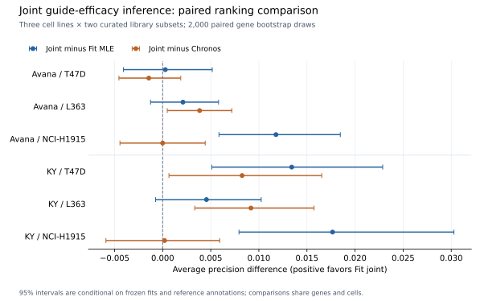
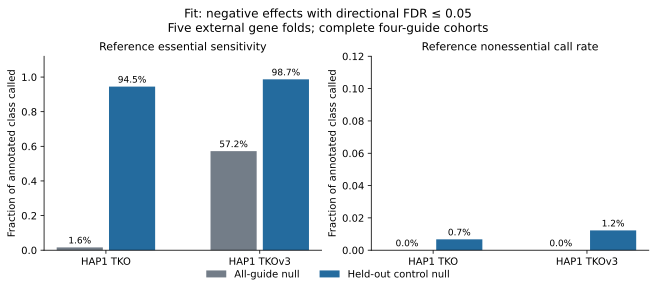

# Scientific validation of gene-level inference

Fit separates numerical compatibility from inference evidence. Its new
`joint` engine adapts JACKS's joint guide-efficacy model; `calibrate` compares
frozen effects with entire negative-control gene effects. The default MLE
engine continues to preserve MAGeCK2 compatibility.

The [frontier report](FRONTIER.md) compares current **Chronos 2.3.15**,
**JACKS 0.2**, Fit MLE and production Fit joint on three cell lines and two
libraries. Joint improves AP over MLE in all six comparisons, by
**0.0003–0.0177**, and exceeds Chronos in four. Three of the six conditional
paired AP intervals against MLE exclude zero; these are correlated comparisons
with frozen fits, not independent screen-level confidence intervals. The
curated Chronos vignette subsets are enriched for controls, so this evidence
does not establish superiority on complete genome-wide screens.

Every fitted joint effect in all ten library/fold runs matches unmodified
JACKS under the same NumPy 1.26.4 environment: maximum absolute difference
**4.45e-16**. Production runs use NumPy 2.3.5. Its rounding at near-tied means
changes variance-window ordering in a few guides, giving maximum cross-version
effect difference **0.001945**; the production rankings are reported directly.
The checked-in independent fixture tests effects, posterior standard deviations
and guide efficacies, including single- and replicated-baseline handling.

The [known-truth null experiment](NULL-CALIBRATION.md) isolates correlation
in score calibration. With shared within-gene artifacts and 20% true effects,
pooled-guide BH had mean FDP **0.356** versus **0.038** for whole-gene BH;
power fell from **0.909** to **0.438**. Whole-gene BY reduced mean FDP to
**0.003**, with power **0.068**. This tests the stated simulation, not biological
accuracy or the count-to-effect models. Default BY called no hits on the
bounded public panel: finite control counts constrain resolution.

The earlier [HAP1 hit-quality report](HIT-QUALITY.md) compares two public
screens with BAGEL2 and a mean-log-fold-change baseline. It tests finite tails
and control-aware MLE preprocessing, without the new joint model or whole-gene
calibrator. Its results and source hashes remain a historical checkpoint.

At nominal directional FDR 0.05, control normalization and a control-guide
null called **585/619** and **602/610** held-out reference essentials, versus
**10/619** and **349/610** with the all-guide null. It called **5/743** and
**9/734** held-out reference nonessentials. This improvement changes both
normalization and the null background, so it cannot be attributed solely to
the finite-tail correction. Control-lane AP was **0.9983 / 0.9984**, compared
with BAGEL2's **0.9980 / 0.9985**. Neither method won both ranking comparisons.

## Reproduce the current-method panel



Use separate Python 3.12 environments. The comparator requirement files retain
the complete installed dependency sets; source packages are installed at pinned
commits. Chronos uses TensorFlow CPU; UMAP is omitted because only numerical
inference and hit calling are exercised. JACKS uses its compatible historical
NumPy/SciPy versions without modifying its source.

```bash
mkdir -p benchmarks/work/fit-frontier
git clone https://github.com/broadinstitute/Chronos benchmarks/work/fit-frontier/chronos
git -C benchmarks/work/fit-frontier/chronos checkout d85e55f4caabaea240d58c8355894613e5410b5a
git clone https://github.com/felicityallen/JACKS benchmarks/work/fit-frontier/JACKS
git -C benchmarks/work/fit-frontier/JACKS checkout dd5c4be5e83baa5ee79a589b0a8c3a2ac3f7d6ad
python3.12 -m venv benchmarks/work/fit-frontier/fit-env
python3.12 -m venv benchmarks/work/fit-frontier/chronos-env
python3.12 -m venv benchmarks/work/fit-frontier/jacks-env
FIT_PY="$PWD/benchmarks/work/fit-frontier/fit-env/bin/python"
CHRONOS_PY="$PWD/benchmarks/work/fit-frontier/chronos-env/bin/python"
JACKS_PY="$PWD/benchmarks/work/fit-frontier/jacks-env/bin/python"
CC=gcc CXX=g++ "$FIT_PY" -m pip install \
  -c packages/crisprworks-fit/container-constraints.txt ./packages/crisprworks-fit pandas==2.3.3 h5py==3.16.0
"$CHRONOS_PY" -m pip install -r packages/crisprworks-fit/benchmarks/chronos-requirements.txt
"$CHRONOS_PY" -m pip install --no-deps ./benchmarks/work/fit-frontier/chronos
"$JACKS_PY" -m pip install -r packages/crisprworks-fit/benchmarks/jacks-requirements.txt
"$JACKS_PY" -m pip install --no-deps ./benchmarks/work/fit-frontier/JACKS/jacks
"$FIT_PY" packages/crisprworks-fit/benchmarks/frontier.py --method prepare \
  --source benchmarks/work/fit-frontier/chronos --panel benchmarks/work/fit-frontier/panel
"$FIT_PY" packages/crisprworks-fit/benchmarks/frontier.py --method fit \
  --panel benchmarks/work/fit-frontier/panel --python "$FIT_PY"
"$FIT_PY" packages/crisprworks-fit/benchmarks/frontier.py --method chronos \
  --panel benchmarks/work/fit-frontier/panel --python "$CHRONOS_PY"
"$FIT_PY" packages/crisprworks-fit/benchmarks/frontier.py --method jacks \
  --panel benchmarks/work/fit-frontier/panel --python "$JACKS_PY"
"$FIT_PY" packages/crisprworks-fit/benchmarks/frontier.py --method joint \
  --panel benchmarks/work/fit-frontier/panel --python "$FIT_PY"
PYTHONPATH="$PWD/packages/crisprworks-fit/src" "$FIT_PY" \
  packages/crisprworks-fit/benchmarks/frontier.py --method joint --output-tag joint_numpy126 \
  --panel benchmarks/work/fit-frontier/panel --python "$JACKS_PY"
"$FIT_PY" packages/crisprworks-fit/benchmarks/frontier_report.py \
  --panel benchmarks/work/fit-frontier/panel --out benchmarks/work/fit-frontier/results
```

The preparer checks eight source-file hashes. It selects the first three sorted
shared cell IDs with at least two replicates: T47D, L363 and NCI-H1915. It keeps
complete finite-count genes with four Avana or five KY guides, and matches each
treatment to its recorded pDNA batch. There are 816 Avana and 716 KY fitted
genes, with 625/538 evaluated reference genes per cell. Five external gene
folds exclude every evaluation gene from training negative controls. No
hyperparameters are selected on evaluation annotations. Chronos and JACKS
share efficacy information across the three cells; MLE fits cells separately.

Chronos trains for 1,001 predeclared epochs with its default regularization and
official empirical hit calling/two-stage BH. All ten runs reduce their training
cost. JACKS and Fit joint use the default 50-iteration cap/tolerance 0.1, control
median normalization and pseudocount 32, without external guide references or
copy-number correction. Only effect ranking is evaluated for upstream JACKS;
the new empirical gene-control callers are evaluated separately. Joint callers
adjust all three conditions together; MLE callers adjust one cell per fit.

## Regenerate the frontier and null reports

```bash
python packages/crisprworks-fit/benchmarks/frontier_report.py \
  --scores benchmarks/raw/crisprworks_fit_frontier.csv --out benchmarks/work/frontier-report
python packages/crisprworks-fit/benchmarks/null_calibration.py \
  --out benchmarks/work/correlated-null.csv --repeats 200
python packages/crisprworks-fit/benchmarks/null_report.py \
  --scores benchmarks/raw/crisprworks_fit_correlated_null.csv --out benchmarks/work/null-report
MPLCONFIGDIR=/tmp/crisprworks-fit-matplotlib \
  python packages/crisprworks-fit/benchmarks/plot_frontier.py \
  --paired benchmarks/raw/crisprworks_fit_frontier_paired.csv \
  --out benchmarks/figures/crisprworks_fit_frontier.svg
# Rebuild the independent numerical fixture in the pinned JACKS environment:
"$JACKS_PY" packages/crisprworks-fit/benchmarks/joint_oracle.py \
  --jacks-source benchmarks/work/fit-frontier/JACKS --out benchmarks/work/joint_upstream.json
```

The [raw frontier scores](../../../benchmarks/raw/crisprworks_fit_frontier.csv),
[metrics](../../../benchmarks/raw/crisprworks_fit_frontier_metrics.csv),
[paired intervals](../../../benchmarks/raw/crisprworks_fit_frontier_paired.csv)
and [provenance](../../../benchmarks/raw/crisprworks_fit_frontier_provenance.json)
record frozen held-out predictions, versions, commands and artifact hashes.
The ranking figure exports SVG and PDF and requires Matplotlib.
The [simulation replicates](../../../benchmarks/raw/crisprworks_fit_correlated_null.csv)
preserve every seed/scenario/caller, including failed-power outcomes. Tests
compare BH/BY with an independent SciPy oracle and verify that training controls,
missing strata and failed fits cannot silently become discoveries.

## Reproduce the earlier HAP1 comparison

Run from the repository root in a separate benchmark environment:

```bash
python -m pip install -c packages/crisprworks-fit/container-constraints.txt \
  ./packages/crisprworks-fit pandas==2.3.3 scikit-learn==1.7.2 joblib==1.5.2
git clone https://github.com/hart-lab/bagel benchmarks/work/fit-bagel
git -C benchmarks/work/fit-bagel checkout 53388adbb4fb0931e5c9dda135502be19e4555f0
OPENBLAS_NUM_THREADS=1 OMP_NUM_THREADS=1 \
  python packages/crisprworks-fit/benchmarks/hit_quality.py \
  --bagel-root benchmarks/work/fit-bagel --out-dir benchmarks/work/fit-hit-quality \
  --seed 1729 --permutation-round 2 --bootstraps 500
```

The script verifies SHA-256 hashes for both count tables, CEGv2/NEGv1 labels
and BAGEL2 build 115. It selects complete four-guide labels before
normalization and uses T0 plus three T18 samples. Five deterministic,
class-stratified gene folds exclude each evaluation gene from BAGEL2 training
and from Fit's control normalization and permutation background. Fit's
all-guide null is evaluated separately. No hyperparameters are selected on
the evaluation genes. Identical duplicate annotation rows are collapsed;
conflicting class labels fail the run. Missing annotations are recorded.

Both datasets are HAP1 from the same source. CEGv2 and NEGv1 are historical
screen-derived annotations, not independent experimental ground truth.
Annotation overlap with the source screen collection can inflate performance;
external folds prevent fitting-label leakage but cannot remove that bias.
Class prevalence in this curated evaluation differs from a genome-wide
screen. A nonessential call rate is a false-positive frequency in that class,
not the false discovery rate among every reported hit. The pooled-guide null
also assumes that control guide behavior represents tested genes, which may
fail under guide correlation, off-target effects or copy-number effects.

The two permutation rounds are a bounded benchmark setting. Analysis settings
must follow the assay and null-resolution requirements, rather than copying
the benchmark round count. The manifest reports nominal resolution, without
claiming that pooled pseudo-gene draws are independent or exchangeable.

## Regenerate from the recorded scores

```bash
python packages/crisprworks-fit/benchmarks/hit_quality.py \
  --scores benchmarks/raw/crisprworks_fit_hit_quality.csv \
  --out-dir packages/crisprworks-fit/benchmarks --seed 1729 --bootstraps 500
MPLCONFIGDIR=/tmp/crisprworks-fit-matplotlib \
  python packages/crisprworks-fit/benchmarks/plot_hit_quality.py \
  --metrics benchmarks/raw/crisprworks_fit_hit_quality_metrics.csv \
  --out benchmarks/figures/crisprworks_fit_hit_quality.svg
```

The [raw gene scores](../../../benchmarks/raw/crisprworks_fit_hit_quality.csv),
[summary metrics](../../../benchmarks/raw/crisprworks_fit_hit_quality_metrics.csv)
and [provenance](../../../benchmarks/raw/crisprworks_fit_hit_quality_provenance.json)
retain hashes, commands, versions, folds and per-run manifests. Downloaded
count tables and competitor environments are not checked in. Conditional
bootstrap intervals quantify variability across the annotated genes, not
across independent screens or refitted training sets.



The figure also exports a PDF. Plotting requires Matplotlib; report regeneration
and the Fit runtime do not.

AP and ROC AUC were compared against scikit-learn on 500 independent random
rankings including ties; maximum absolute disagreement was `2.23e-16`.
Finite-tail tests independently count exceedances and exhaustively enumerate
all observation-plus-three-null-draw outcomes from a discrete null. All
three tail definitions are superuniform in that exchangeable example.
Additional tests cover failed fits, skipped genes, backend restoration,
source compatibility, full-precision fit parity and control-aware batches.

## Scope relative to current methods

[MAGeCK MLE](https://doi.org/10.1186/s13059-015-0843-6) remains the default
statistical model. [BAGEL2](https://doi.org/10.1186/s13073-020-00809-3) is the
tested supervised essentiality comparator. Its external training folds use
the same reference classes, and its own normalization and pseudocount 5 are
retained. No network boost or multi-target correction is enabled.

[Chronos](https://doi.org/10.1186/s13059-021-02540-7) models growth dynamics and
supports later time points and multiple libraries. Its 2.3 release adds
[hit-calling methods](https://doi.org/10.1101/2025.04.24.650434), including
control-based inference for gene effects from other algorithms.
[JACKS](https://github.com/felicityallen/JACKS) shares guide-efficacy information
across screens. Both are now evaluated on the frozen Broad/Sanger panel; Fit
joint adapts JACKS's model. Fit does not implement Chronos's growth model or
copy-number correction.

An overall state-of-the-art claim still needs complete screens across independent
labs, held-out perturbation evidence, calibrated error rates across coverage and
guide-efficacy regimes, copy-number effects and validated multi-condition
contrasts. Historical annotations may overlap the source screen collection;
gene holdout cannot remove that collection-level bias. Controls must remain
exchangeable with tested null genes after the complete preprocessing and fit;
normalization reuse and fitted model differences need assessment for each assay.
Finite tails and BH/BY do not establish that assumption. Nonessential class
call frequencies are not genome-wide FDR measurements.
